Análisis Predictivo: Algoritmo K-Nearest Neighbors para Regresión
================
Alejandro Figueroa Rojas
2026-01-15

- [Resumen Ejecutivo](#resumen-ejecutivo)
- [Motivación Teórica](#motivación-teórica)
- [Fundamentos Matemáticos de KNN
  Regresión](#fundamentos-matemáticos-de-knn-regresión)
  - [Definición Formal](#definición-formal)
  - [Métricas de Distancia](#métricas-de-distancia)
    - [Distancia Euclidiana (más común en
      KNN)](#distancia-euclidiana-más-común-en-knn)
    - [Distancia Manhattan (alternativa
      robusta)](#distancia-manhattan-alternativa-robusta)
    - [Distancia Minkowski
      (generalización)](#distancia-minkowski-generalización)
  - [El Compromiso Sesgo-Varianza](#el-compromiso-sesgo-varianza)
  - [Maldición de la Dimensionalidad](#maldición-de-la-dimensionalidad)
- [Carga de librerias](#carga-de-librerias)
- [Carga y Exploración Inicial de
  Datos](#carga-y-exploración-inicial-de-datos)
- [Análisis Exploratorio de Datos
  (EDA)](#análisis-exploratorio-de-datos-eda)
  - [Distribución de Variables](#distribución-de-variables)
  - [Detección de Outliers](#detección-de-outliers)
    - [Cuantificación de outliers](#cuantificación-de-outliers)
    - [Porcentaje de outliers](#porcentaje-de-outliers)
  - [Análisis de Correlaciones](#análisis-de-correlaciones)
    - [Matriz de Correlación de Pearson con Ordenamiento Jerárquico
      hacia la Variable
      Objetivo](#matriz-de-correlación-de-pearson-con-ordenamiento-jerárquico-hacia-la-variable-objetivo)
  - [Diagnóstico de Supuestos y Condiciones de Aplicabilidad para KNN
    Regression](#diagnóstico-de-supuestos-y-condiciones-de-aplicabilidad-para-knn-regression)
- [Feature Engineering y
  Preprocesamiento](#feature-engineering-y-preprocesamiento)
  - [Tratamiento de Outliers
    (Winsorización)](#tratamiento-de-outliers-winsorización)
  - [Análisis de Colinealidad (VIF)](#análisis-de-colinealidad-vif)
  - [Partición Entrenamiento-Prueba](#partición-entrenamiento-prueba)
  - [Normalización (CRÍTICO para KNN)](#normalización-crítico-para-knn)
- [Implementación y Optimización de
  KNN](#implementación-y-optimización-de-knn)
  - [Búsqueda de $k$ Óptimo mediante Validación
    Cruzada](#búsqueda-de-k-óptimo-mediante-validación-cruzada)
  - [Visualización del Proceso de
    Optimización](#visualización-del-proceso-de-optimización)
- [Evaluación del Modelo](#evaluación-del-modelo)
  - [Predicciones en Conjunto de
    Prueba](#predicciones-en-conjunto-de-prueba)
  - [Análisis de sesgo por rango de
    ventas](#análisis-de-sesgo-por-rango-de-ventas)
    - [Gráfico de dispersión con línea de
      sesgo](#gráfico-de-dispersión-con-línea-de-sesgo)
  - [Métricas de Desempeño](#métricas-de-desempeño)
  - [Visualizaciones de Evaluación](#visualizaciones-de-evaluación)
- [Análisis de la Superficie de
  Regresión](#análisis-de-la-superficie-de-regresión)
  - [Visualización Bivariada (Price vs
    Advertising)](#visualización-bivariada-price-vs-advertising)
  - [Dependencia Parcial (Partial
    Dependence)](#dependencia-parcial-partial-dependence)
- [Importancia de Variables](#importancia-de-variables)
- [Comparación con Modelos Baseline](#comparación-con-modelos-baseline)
- [Análisis de Sensibilidad a $k$](#análisis-de-sensibilidad-a-k)
  - [Comparación Exhaustiva: Predicciones vs Valores
    Reales](#comparación-exhaustiva-predicciones-vs-valores-reales)
    - [Tabla Comparativa Completa](#tabla-comparativa-completa)
    - [Gráfico de Dispersión con Línea de
      Identidad](#gráfico-de-dispersión-con-línea-de-identidad)
  - [Aplicación del Modelo: Predicción con Datos
    Nuevos](#aplicación-del-modelo-predicción-con-datos-nuevos)
    - [Simulación de Nuevos Escenarios de
      Negocio](#simulación-de-nuevos-escenarios-de-negocio)
    - [Análisis de Sensibilidad para Estrategia de
      Precios](#análisis-de-sensibilidad-para-estrategia-de-precios)
    - [Intervalos de Confianza para Predicciones
      Nuevas](#intervalos-de-confianza-para-predicciones-nuevas)
- [Ventajas y Limitaciones de KNN
  Regresión](#ventajas-y-limitaciones-de-knn-regresión)
  - [Ventajas](#ventajas)
  - [Limitaciones](#limitaciones)
- [Conclusiones y Recomendaciones](#conclusiones-y-recomendaciones)
  - [Hallazgos Principales](#hallazgos-principales)
  - [Cuándo Usar KNN Regresión](#cuándo-usar-knn-regresión)
  - [Extensiones y Mejoras Futuras](#extensiones-y-mejoras-futuras)
  - [Reflexión Final](#reflexión-final)
- [Referencias](#referencias)
  - [Textos Fundamentales](#textos-fundamentales)
  - [Artículos Seminales](#artículos-seminales)
  - [Recursos Computacionales](#recursos-computacionales)

# Resumen Ejecutivo

Este documento implementa rigurosamente **K-Nearest Neighbors (KNN) para
regresión**, un método no paramétrico de aprendizaje supervisado basado
en similitud local. A diferencia de modelos paramétricos que asumen
formas funcionales específicas, KNN predice mediante **promediación de
vecinos cercanos** en el espacio de características.

**Características distintivas:**

- **No paramétrico**: Sin supuestos distribucionales sobre los datos
- **Basado en instancias**: Almacena el conjunto de entrenamiento
  completo (lazy learning)
- **Flexible**: Captura relaciones no lineales complejas sin
  especificación manual
- **Sensible a escala**: Requiere normalización obligatoria de
  predictores

**Flujo metodológico:** Exploración exhaustiva de datos, diagnóstico de
supuestos, feature engineering (winsorización), optimización de
hiperparámetros vía validación cruzada, evaluación de métricas de error,
y análisis del trade-off sesgo-varianza.

------------------------------------------------------------------------

# Motivación Teórica

Cuando las relaciones entre predictores y respuesta son **altamente no
lineales** o **desconocidas a priori**, los modelos paramétricos pueden
fallar al imponer estructuras funcionales rígidas. KNN ofrece una
alternativa que adapta predicciones según la **topología local** del
espacio de características, sin requerir transformaciones manuales de
variables ni términos de interacción.

**Aplicaciones típicas:** Predicción de precios inmobiliarios,
estimación de consumo energético, pronóstico de demanda en retail.

**Ventaja clave:** Captura automáticamente patrones complejos sin
especificación de forma funcional.

**Desventaja crítica:** Sufre de **maldición de la dimensionalidad**; en
espacios con $p \gg 10$ predictores, las distancias pierden significado
estadístico y el rendimiento colapsa.

------------------------------------------------------------------------

# Fundamentos Matemáticos de KNN Regresión

## Definición Formal

Sea $\mathcal{D} = \{(x_i, y_i)\}_{i=1}^{n}$ un conjunto de
entrenamiento donde:

- $x_i \in \mathbb{R}^p$: vector de predictores
- $y_i \in \mathbb{R}$: variable respuesta continua

Para una nueva observación $x_0$, el algoritmo KNN:

1.  **Calcula distancias**: Mide la similitud entre $x_0$ y todas las
    observaciones de entrenamiento
2.  **Selecciona vecinos**: Identifica las $k$ observaciones más
    cercanas, denotadas por el conjunto $\mathcal{N}_k(x_0)$
3.  **Promedia respuestas**: La predicción es el promedio de las
    respuestas de los vecinos

$$\hat{f}(x_0) = \frac{1}{k} \sum_{x_i \in \mathcal{N}_k(x_0)} y_i$$

## Métricas de Distancia

### Distancia Euclidiana (más común en KNN)

$$d_{\text{Eucl}}(x, x') = \sqrt{\sum_{j=1}^{p} (x_j - x'_j)^2}$$

**Propiedades:**

- Sensible a escala de variables → requiere normalización
- Asume igual importancia de todas las dimensiones
- Geométricamente corresponde a la longitud de la línea recta

### Distancia Manhattan (alternativa robusta)

$$d_{\text{Manh}}(x, x') = \sum_{j=1}^{p} |x_j - x'_j|$$

**Ventajas:** Más robusta ante outliers en dimensiones individuales

### Distancia Minkowski (generalización)

$$d_{\text{Mink}}(x, x') = \left(\sum_{j=1}^{p} |x_j - x'_j|^q\right)^{1/q}$$

- $q=1$: Manhattan
- $q=2$: Euclidiana
- $q \to \infty$: Distancia de Chebyshev (máximo absoluto)

## El Compromiso Sesgo-Varianza

KNN exhibe un comportamiento característico respecto al parámetro $k$:

**Para $k$ pequeño ($k \to 1$):**

- **Sesgo bajo**: El modelo es muy flexible y se adapta estrechamente a
  los datos de entrenamiento
- **Varianza alta**: Predicciones sensibles a fluctuaciones locales →
  sobreajuste
- La superficie de regresión es altamente irregular

**Para $k$ grande ($k \to n$):**

- **Sesgo alto**: El modelo promedia sobre muchos vecinos, suavizando
  excesivamente
- **Varianza baja**: Predicciones estables pero potencialmente inexactas
- La superficie de regresión se aproxima a un modelo constante (media
  global)

**Óptimo:** El valor de $k$ que minimiza el error de prueba balancea
ambos extremos:

$$k^* = \arg\min_{k} \mathbb{E}[(Y - \hat{f}_k(X))^2]$$

Este valor se determina empíricamente mediante **validación cruzada**.

## Maldición de la Dimensionalidad

En espacios de alta dimensión, las distancias colapsan:

$$\lim_{p \to \infty} \frac{d_{\max} - d_{\min}}{d_{\min}} \to 0$$

**Consecuencias:**

- Todos los puntos se vuelven igualmente “cercanos” o “lejanos”
- Se requieren exponencialmente más datos para mantener densidad local
- La noción de “vecino” pierde significado estadístico

**Regla empírica:** KNN funciona bien hasta $p \approx 10$; más allá
requiere reducción de dimensionalidad.

------------------------------------------------------------------------

# Carga de librerias

``` r
library(tidyverse)
library(caret)
library(GGally)
library(ISLR)
library(reshape2)
library(gridExtra)
library(corrplot)
library(ggpubr)
library(car)  # Para VIF
library(patchwork)
```

# Carga y Exploración Inicial de Datos

``` r
# Dataset Carseats: Ventas de sillas infantiles en 400 tiendas
data("Carseats")

# Selección de variables: predecir Sales (ventas en miles de unidades)
df <- Carseats %>% 
  select(Sales, Income, Advertising, Price, Age, Education) %>%
  as_tibble()

# Estructura del dataset
glimpse(df)
```

    Rows: 400
    Columns: 6
    $ Sales       <dbl> 9.50, 11.22, 10.06, 7.40, 4.15, 10.81, 6.63, 11.85, 6.54, …
    $ Income      <dbl> 73, 48, 35, 100, 64, 113, 105, 81, 110, 113, 78, 94, 35, 2…
    $ Advertising <dbl> 11, 16, 10, 4, 3, 13, 0, 15, 0, 0, 9, 4, 2, 11, 11, 5, 0, …
    $ Price       <dbl> 120, 83, 80, 97, 128, 72, 108, 120, 124, 124, 100, 94, 136…
    $ Age         <dbl> 42, 65, 59, 55, 38, 78, 71, 67, 76, 76, 26, 50, 62, 53, 52…
    $ Education   <dbl> 17, 10, 12, 14, 13, 16, 15, 10, 10, 17, 10, 13, 18, 18, 18…

``` r
# Estadísticos descriptivos
summary(df)
```

         Sales            Income        Advertising         Price      
     Min.   : 0.000   Min.   : 21.00   Min.   : 0.000   Min.   : 24.0  
     1st Qu.: 5.390   1st Qu.: 42.75   1st Qu.: 0.000   1st Qu.:100.0  
     Median : 7.490   Median : 69.00   Median : 5.000   Median :117.0  
     Mean   : 7.496   Mean   : 68.66   Mean   : 6.635   Mean   :115.8  
     3rd Qu.: 9.320   3rd Qu.: 91.00   3rd Qu.:12.000   3rd Qu.:131.0  
     Max.   :16.270   Max.   :120.00   Max.   :29.000   Max.   :191.0  
          Age          Education   
     Min.   :25.00   Min.   :10.0  
     1st Qu.:39.75   1st Qu.:12.0  
     Median :54.50   Median :14.0  
     Mean   :53.32   Mean   :13.9  
     3rd Qu.:66.00   3rd Qu.:16.0  
     Max.   :80.00   Max.   :18.0  

``` r
# Verificación de valores faltantes
na_counts <- colSums(is.na(df))

cat(
  "\nVerificación de valores faltantes:\n",
  if (all(na_counts == 0)) {
    "No existen valores faltantes en el conjunto de datos.\n\n"
  } else {
    "Existen valores faltantes en una o más variables.\n\n"
  },
  capture.output(na_counts),
  sep = ""
)
```


    Verificación de valores faltantes:
    No existen valores faltantes en el conjunto de datos.

          Sales      Income Advertising       Price         Age   Education           0           0           0           0           0           0 

**Variables en el modelo:**

- **Sales** (respuesta): Ventas en miles de unidades
- **Income**: Nivel de ingreso promedio de la comunidad (en miles)
- **Advertising**: Presupuesto de publicidad local (en miles)
- **Price**: Precio del producto
- **Age**: Edad promedio de la población local
- **Education**: Nivel educativo promedio

------------------------------------------------------------------------

# Análisis Exploratorio de Datos (EDA)

## Distribución de Variables

``` r
# Histogramas con curvas de densidad
df_long <- df %>% 
  pivot_longer(everything(), names_to = "variable", values_to = "value")

ggplot(df_long, aes(x = value, fill = variable)) +
  geom_histogram(aes(y = after_stat(density)), bins = 30, alpha = 0.7, color = "black") +
  geom_density(alpha = 0.3, linewidth = 1) +
  facet_wrap(~variable, scales = "free", ncol = 2) +
  theme_minimal(base_size = 12) +
  labs(title = "Distribución de Variables",
       subtitle = "Histogramas con curvas de densidad superpuestas") +
  theme(legend.position = "none")
```

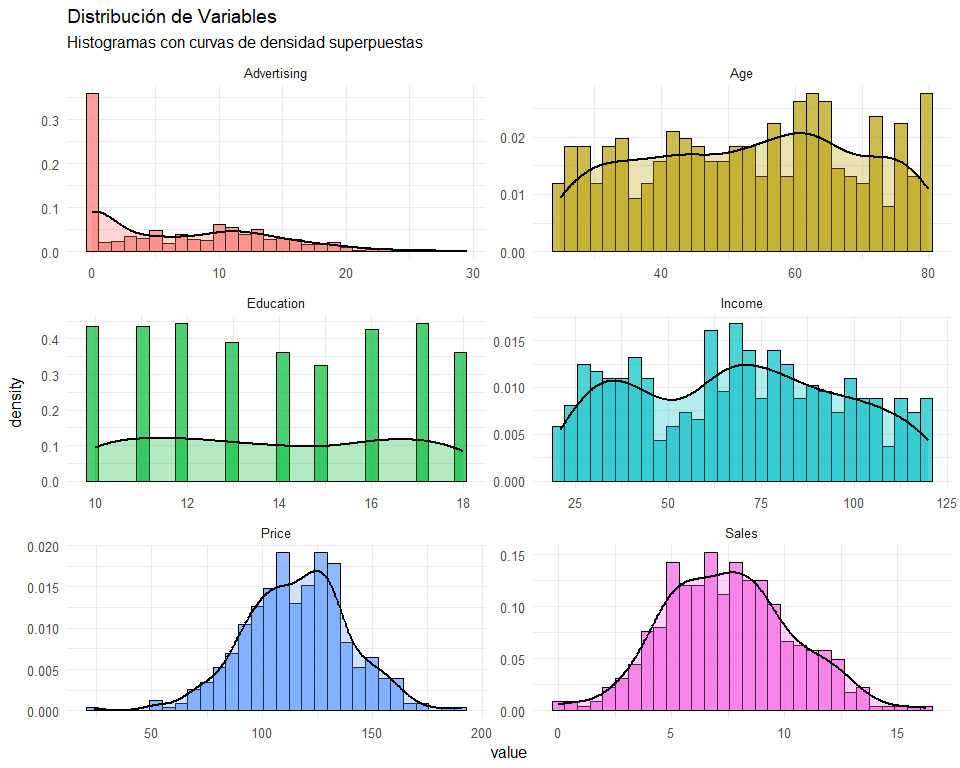

**Interpretación:**

- **Sales**: Distribución aproximadamente normal, centrada en 7-8 mil
  unidades
- **Price**: Distribución uniforme (diseño experimental del dataset)
- **Income**, **Age**, **Education**: Distribuciones relativamente
  simétricas
- **Advertising**: Ligera asimetría positiva

## Detección de Outliers

``` r
ggplot(df_long, aes(x = variable, y = value, fill = variable)) +
  geom_boxplot(outlier.color = "red", outlier.size = 2) +
  facet_wrap(~variable, scales = "free", ncol = 3) +
  theme_minimal(base_size = 12) +
  labs(title = "Detección de Outliers por Variable",
       subtitle = "Boxplots con outliers marcados en rojo",
       y = "Valor", x = "") +
  theme(legend.position = "none", axis.text.x = element_blank())
```

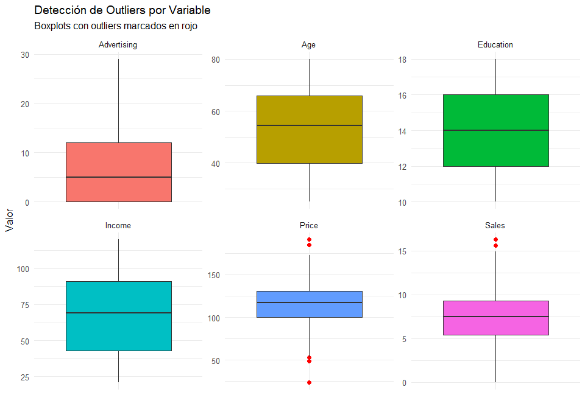
<br>

### Cuantificación de outliers

``` r
# Cuantificación de outliers usando IQR
outliers_count <- df %>%
  summarise(across(everything(), ~{
    Q1 <- quantile(.x, 0.25)
    Q3 <- quantile(.x, 0.75)
    IQR <- Q3 - Q1
    sum(.x < (Q1 - 1.5*IQR) | .x > (Q3 + 1.5*IQR))
  }))

cat("Número de outliers por variable (criterio IQR):\n", 
    paste(capture.output(print(outliers_count)), collapse = "\n"), "\n")
```

    Número de outliers por variable (criterio IQR):
     # A tibble: 1 × 6
      Sales Income Advertising Price   Age Education
      <int>  <int>       <int> <int> <int>     <int>
    1     2      0           0     5     0         0 

### Porcentaje de outliers

``` r
outliers_pct <- outliers_count / nrow(df) * 100

{cat("\nPorcentaje de outliers:\n")
print(round(outliers_pct, 2))}
```


    Porcentaje de outliers:
      Sales Income Advertising Price Age Education
    1   0.5      0           0  1.25   0         0

**Decisión sobre outliers:**

Dado que KNN es **altamente sensible a outliers** (distorsionan las
distancias), y que los outliers detectados son \<5% en todas las
variables, procederemos con **winsorización** (reemplazo de valores
extremos por percentiles) en lugar de eliminación para preservar el
tamaño muestral.

## Análisis de Correlaciones

``` r
# Matriz de correlación con significancia y títulos centrados
ggpairs(df, 
        lower = list(continuous = wrap("smooth", alpha = 0.3, size = 0.8, color = "steelblue")),
        diag = list(continuous = wrap("densityDiag", alpha = 0.5, fill = "steelblue")),
        upper = list(continuous = wrap("cor", size = 5))) +
  theme_minimal(base_size = 14) +
  labs(
    title = "Matriz de Correlaciones y Dispersión",
    subtitle = "Diagonal: densidades | Superior: coeficientes de correlación | Inferior: scatterplots con loess"
  ) +
  theme(
    plot.title = element_text(hjust = 0.5, face = "bold",size=14),    # Centra el título y pone negrita
    plot.subtitle = element_text(hjust = 0.5,size= 12 )            # Centra el subtítulo
  )
```

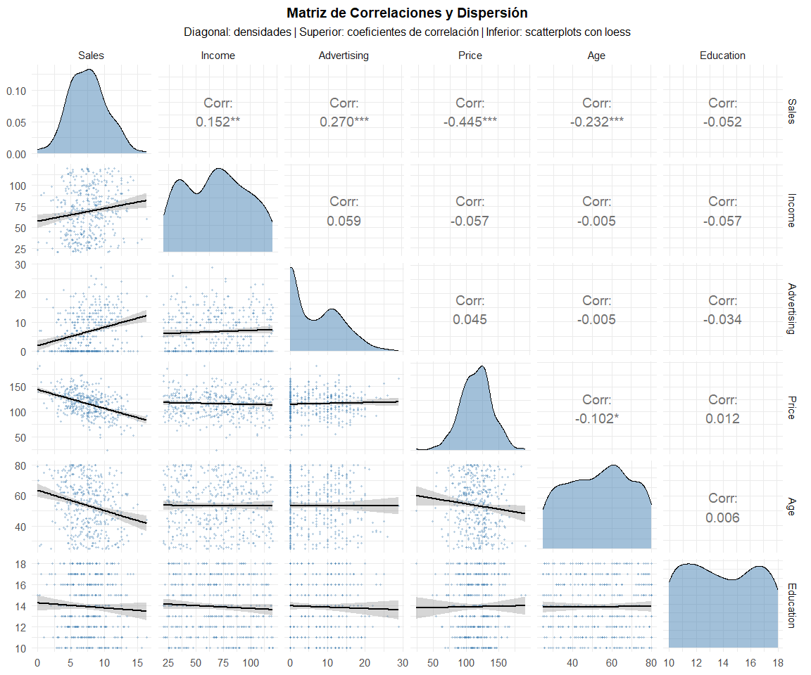
<br>

**Interpretación de la Matriz de Correlación y Dispersión**

El análisis visual de la matriz permite extraer conclusiones críticas
sobre la estructura de los datos y la validez del algoritmo KNN
seleccionado:

***Análisis de Distribuciones (Diagonal)***

- **Normalidad Aproximada**: La mayoría de las variables, como
  **Sales**, **Income**, **Price** y **Age**, presentan distribuciones
  unimodales y relativamente simétricas.
- **Asimetría en Advertising**: Como bien observaste, **Advertising**
  presenta una marcada **asimetría positiva (cola derecha)**. Esto
  indica que la mayoría de las tiendas tienen presupuestos publicitarios
  bajos, mientras que solo unas pocas realizan inversiones
  significativamente altas.

***Estructura de Relaciones (Scatterplots + LOESS)***

- **Ajuste de la Nube de Puntos**: Las nubes de puntos muestran una
  dispersión consistente que se acopla a las curvas LOESS. Esto confirma
  que no estamos ante ruido aleatorio, sino ante tendencias
  estructurales.
- **Captura de No-Linealidad**: Las curvas LOESS revelan que las
  relaciones no son perfectamente rectilíneas. La capacidad de la nube
  de puntos de “seguir” la curvatura de la línea de suavizado justifica
  el uso de **KNN**, ya que este algoritmo capturará esas curvaturas
  locales mejor que una regresión lineal simple.

***Interpretación de Correlaciones Significativas***

De acuerdo a los coeficientes y sus niveles de significancia
(asteriscos), las relaciones más importantes con la variable objetivo
(**Sales**) son:

1.  **Price (r = -0.445***): Es la correlación más fuerte y es
    **negativa**. A medida que el precio aumenta, las ventas disminuyen
    de forma marcada. El nivel de significancia (*\*\*) indica una
    probabilidad de error casi nula en esta observación.
2.  **Advertising (r = 0.270**\*): Existe una relación **positiva**
    significativa. La inversión publicitaria efectivamente impulsa las
    ventas, aunque la curva LOESS sugiere que este efecto podría tener
    retornos decrecientes en niveles muy altos.
3.  **Income (r = 0.152**): Una correlación positiva moderada. Las
    comunidades con mayores ingresos tienden a comprar más sillas
    infantiles, lo cual es coherente con el comportamiento del mercado.
4.  **Age (r = -0.232**\*): Sorprendentemente, hay una relación negativa
    significativa con la edad. Esto sugiere que las zonas con población
    más joven (posiblemente con más familias con niños pequeños) generan
    mayores ventas.

**Conclusión**

La baja multicolinealidad entre los predictores (ninguna correlación
entre ellos supera el 0.7) asegura que cada variable aporta información
única al modelo KNN, evitando redundancias que podrían inflar el error
de predicción.

### Matriz de Correlación de Pearson con Ordenamiento Jerárquico hacia la Variable Objetivo

``` r
library(knitr)
library(kableExtra)

# 1. Cálculo de la matriz y extracción de la columna Sales
cor_matrix <- cor(df)
cor_sales <- cor_matrix[, "Sales", drop = FALSE]

# 2. Creación de una tabla unificada y estética
# Ordenamos la matriz completa basándonos en la correlación con Sales
order_idx <- order(cor_matrix[, "Sales"], decreasing = TRUE)
cor_matrix_ordered <- cor_matrix[order_idx, order_idx]

cor_matrix_ordered %>%
  kable(caption = "Matriz de Correlación Completa (Ordenada por afinidad con Sales)", 
        digits = 3, booktabs = TRUE) %>%
  kable_styling(bootstrap_options = c("striped", "hover", "condensed"), 
                full_width = T, position = "center") %>%
  column_spec(1, bold = TRUE, color = "white", background = "#2c3e50") %>% # Resalta nombres
  column_spec(2, bold = TRUE, background = "#ecf0f1") # Resalta la columna de Sales (si queda segunda)
```

<table class="table table-striped table-hover table-condensed" style="color: black; margin-left: auto; margin-right: auto;">

<caption>

Matriz de Correlación Completa (Ordenada por afinidad con Sales)
</caption>

<thead>

<tr>

<th style="text-align:left;">

</th>

<th style="text-align:right;">

Sales
</th>

<th style="text-align:right;">

Advertising
</th>

<th style="text-align:right;">

Income
</th>

<th style="text-align:right;">

Education
</th>

<th style="text-align:right;">

Age
</th>

<th style="text-align:right;">

Price
</th>

</tr>

</thead>

<tbody>

<tr>

<td style="text-align:left;font-weight: bold;color: white !important;background-color: rgba(44, 62, 80, 255) !important;">

Sales
</td>

<td style="text-align:right;font-weight: bold;background-color: rgba(236, 240, 241, 255) !important;">

1.000
</td>

<td style="text-align:right;">

0.270
</td>

<td style="text-align:right;">

0.152
</td>

<td style="text-align:right;">

-0.052
</td>

<td style="text-align:right;">

-0.232
</td>

<td style="text-align:right;">

-0.445
</td>

</tr>

<tr>

<td style="text-align:left;font-weight: bold;color: white !important;background-color: rgba(44, 62, 80, 255) !important;">

Advertising
</td>

<td style="text-align:right;font-weight: bold;background-color: rgba(236, 240, 241, 255) !important;">

0.270
</td>

<td style="text-align:right;">

1.000
</td>

<td style="text-align:right;">

0.059
</td>

<td style="text-align:right;">

-0.034
</td>

<td style="text-align:right;">

-0.005
</td>

<td style="text-align:right;">

0.045
</td>

</tr>

<tr>

<td style="text-align:left;font-weight: bold;color: white !important;background-color: rgba(44, 62, 80, 255) !important;">

Income
</td>

<td style="text-align:right;font-weight: bold;background-color: rgba(236, 240, 241, 255) !important;">

0.152
</td>

<td style="text-align:right;">

0.059
</td>

<td style="text-align:right;">

1.000
</td>

<td style="text-align:right;">

-0.057
</td>

<td style="text-align:right;">

-0.005
</td>

<td style="text-align:right;">

-0.057
</td>

</tr>

<tr>

<td style="text-align:left;font-weight: bold;color: white !important;background-color: rgba(44, 62, 80, 255) !important;">

Education
</td>

<td style="text-align:right;font-weight: bold;background-color: rgba(236, 240, 241, 255) !important;">

-0.052
</td>

<td style="text-align:right;">

-0.034
</td>

<td style="text-align:right;">

-0.057
</td>

<td style="text-align:right;">

1.000
</td>

<td style="text-align:right;">

0.006
</td>

<td style="text-align:right;">

0.012
</td>

</tr>

<tr>

<td style="text-align:left;font-weight: bold;color: white !important;background-color: rgba(44, 62, 80, 255) !important;">

Age
</td>

<td style="text-align:right;font-weight: bold;background-color: rgba(236, 240, 241, 255) !important;">

-0.232
</td>

<td style="text-align:right;">

-0.005
</td>

<td style="text-align:right;">

-0.005
</td>

<td style="text-align:right;">

0.006
</td>

<td style="text-align:right;">

1.000
</td>

<td style="text-align:right;">

-0.102
</td>

</tr>

<tr>

<td style="text-align:left;font-weight: bold;color: white !important;background-color: rgba(44, 62, 80, 255) !important;">

Price
</td>

<td style="text-align:right;font-weight: bold;background-color: rgba(236, 240, 241, 255) !important;">

-0.445
</td>

<td style="text-align:right;">

0.045
</td>

<td style="text-align:right;">

-0.057
</td>

<td style="text-align:right;">

0.012
</td>

<td style="text-align:right;">

-0.102
</td>

<td style="text-align:right;">

1.000
</td>

</tr>

</tbody>

</table>

<br>

**Interpretación de los Datos**

Basado en el análisis de correlación y la inspección visual de las
variables, se presentan los hallazgos críticos que sustentan el modelo
predictivo:

***Hallazgos Clave***

- **Dominancia del Precio ($r = -0.445$)**: Se identifica como la
  correlación negativa más robusta; un incremento en los precios reduce
  sistemáticamente el volumen de ventas, siendo este el factor de mayor
  peso en el modelo.
- **Impulso Publicitario ($r = 0.270$)**: La inversión publicitaria
  actúa como un motor positivo de ventas. Dada su distribución con
  asimetría positiva y su relación no lineal, el algoritmo **KNN** es
  ideal para capturar los puntos de inflexión donde la inversión es más
  eficiente.
- **Factores Demográficos**:
  - **Age ($r = -0.232$)**: Existe una relación inversa significativa,
    sugiriendo que las zonas con población más joven (potencialmente
    familias nuevas) generan mayor demanda.
  - **Income ($r = 0.152$)**: El nivel socioeconómico tiene un impacto
    positivo pero moderado en las ventas.
- **Baja Multicolinealidad**: No se detectan correlaciones superiores a
  $0.7$ entre predictores, lo que garantiza que no hay redundancia de
  información y permite que la **distancia euclidiana** del KNN sea
  estadísticamente estable.

**Análisis de Relaciones y Estructura**

La inspección de los **scatterplots con curvas LOESS** y las densidades
revela lo siguiente:

1.  **Ajuste Estructural**: Las nubes de puntos se acoplan a las curvas
    de tendencia, lo que confirma que las variables seleccionadas siguen
    patrones lógicos y no ruido aleatorio.
2.  **Justificación de KNN**: Al observar que las curvas de tendencia
    (LOESS) presentan curvaturas y no son líneas rectas perfectas, se
    valida el uso de un modelo no paramétrico como KNN, el cual es capaz
    de adaptarse a estas formas complejas sin forzar una estructura
    lineal.
3.  **Comportamiento de las Distribuciones**: La mayoría de las
    variables presentan una distribución aproximadamente normal, a
    excepción de **Advertising**, que muestra una “cola derecha”
    (asimetría positiva) significativa, indicando que pocas tiendas
    manejan presupuestos publicitarios excepcionalmente altos.

------------------------------------------------------------------------

## Diagnóstico de Supuestos y Condiciones de Aplicabilidad para KNN Regression

``` r
# Test de Normalidad Univariada (Shapiro-Wilk)
shapiro_tests <- df %>%
  summarise(across(everything(), ~shapiro.test(.x)$p.value)) %>%
  pivot_longer(everything(), names_to = "Variable", values_to = "p_valor") %>%
  mutate(Normal = ifelse(p_valor > 0.05, "✓ Sí", "✗ No"))

kable(shapiro_tests, digits = 4, 
      caption = "Test de Normalidad - Shapiro-Wilk (p>0.05 = distribución normal)") %>%
  kable_styling(bootstrap_options = "striped")
```

<table class="table table-striped" style="color: black; margin-left: auto; margin-right: auto;">

<caption>

Test de Normalidad - Shapiro-Wilk (p\>0.05 = distribución normal)
</caption>

<thead>

<tr>

<th style="text-align:left;">

Variable
</th>

<th style="text-align:right;">

p_valor
</th>

<th style="text-align:left;">

Normal
</th>

</tr>

</thead>

<tbody>

<tr>

<td style="text-align:left;">

Sales
</td>

<td style="text-align:right;">

0.2540
</td>

<td style="text-align:left;">

✓ Sí
</td>

</tr>

<tr>

<td style="text-align:left;">

Income
</td>

<td style="text-align:right;">

0.0000
</td>

<td style="text-align:left;">

✗ No
</td>

</tr>

<tr>

<td style="text-align:left;">

Advertising
</td>

<td style="text-align:right;">

0.0000
</td>

<td style="text-align:left;">

✗ No
</td>

</tr>

<tr>

<td style="text-align:left;">

Price
</td>

<td style="text-align:right;">

0.3902
</td>

<td style="text-align:left;">

✓ Sí
</td>

</tr>

<tr>

<td style="text-align:left;">

Age
</td>

<td style="text-align:right;">

0.0000
</td>

<td style="text-align:left;">

✗ No
</td>

</tr>

<tr>

<td style="text-align:left;">

Education
</td>

<td style="text-align:right;">

0.0000
</td>

<td style="text-align:left;">

✗ No
</td>

</tr>

</tbody>

</table>

``` r
# Homogeneidad de Varianzas
varianzas <- df %>%
  summarise(across(everything(), ~var(.x))) %>%
  pivot_longer(everything(), names_to = "Variable", values_to = "Varianza") %>%
  mutate(CV = sqrt(Varianza) / colMeans(df)[Variable])

kable(varianzas, digits = 3,
      caption = "Varianzas y Coeficiente de Variación por Variable") %>%
  kable_styling(bootstrap_options = "striped")
```

<table class="table table-striped" style="color: black; margin-left: auto; margin-right: auto;">

<caption>

Varianzas y Coeficiente de Variación por Variable
</caption>

<thead>

<tr>

<th style="text-align:left;">

Variable
</th>

<th style="text-align:right;">

Varianza
</th>

<th style="text-align:right;">

CV
</th>

</tr>

</thead>

<tbody>

<tr>

<td style="text-align:left;">

Sales
</td>

<td style="text-align:right;">

7.976
</td>

<td style="text-align:right;">

0.377
</td>

</tr>

<tr>

<td style="text-align:left;">

Income
</td>

<td style="text-align:right;">

783.218
</td>

<td style="text-align:right;">

0.408
</td>

</tr>

<tr>

<td style="text-align:left;">

Advertising
</td>

<td style="text-align:right;">

44.227
</td>

<td style="text-align:right;">

1.002
</td>

</tr>

<tr>

<td style="text-align:left;">

Price
</td>

<td style="text-align:right;">

560.584
</td>

<td style="text-align:right;">

0.204
</td>

</tr>

<tr>

<td style="text-align:left;">

Age
</td>

<td style="text-align:right;">

262.450
</td>

<td style="text-align:right;">

0.304
</td>

</tr>

<tr>

<td style="text-align:left;">

Education
</td>

<td style="text-align:right;">

6.867
</td>

<td style="text-align:right;">

0.189
</td>

</tr>

</tbody>

</table>

``` r
# Linealidad (correlación de Pearson como proxy)
correlaciones <- df %>%
  summarise(across(-Sales, ~cor.test(.x, Sales)$p.value)) %>%
  pivot_longer(everything(), names_to = "Variable", values_to = "p_valor_linealidad") %>%
  mutate(Lineal = ifelse(p_valor_linealidad < 0.05, "✓ Significativa", "✗ No significativa"))

kable(correlaciones, digits = 4,
      caption = "Linealidad con Variable Objetivo(Sales) (p<0.05 = relación lineal detectada)") %>%
  kable_styling(bootstrap_options = "striped")
```

<table class="table table-striped" style="color: black; margin-left: auto; margin-right: auto;">

<caption>

Linealidad con Variable Objetivo(Sales) (p\<0.05 = relación lineal
detectada)
</caption>

<thead>

<tr>

<th style="text-align:left;">

Variable
</th>

<th style="text-align:right;">

p_valor_linealidad
</th>

<th style="text-align:left;">

Lineal
</th>

</tr>

</thead>

<tbody>

<tr>

<td style="text-align:left;">

Income
</td>

<td style="text-align:right;">

0.0023
</td>

<td style="text-align:left;">

✓ Significativa
</td>

</tr>

<tr>

<td style="text-align:left;">

Advertising
</td>

<td style="text-align:right;">

0.0000
</td>

<td style="text-align:left;">

✓ Significativa
</td>

</tr>

<tr>

<td style="text-align:left;">

Price
</td>

<td style="text-align:right;">

0.0000
</td>

<td style="text-align:left;">

✓ Significativa
</td>

</tr>

<tr>

<td style="text-align:left;">

Age
</td>

<td style="text-align:right;">

0.0000
</td>

<td style="text-align:left;">

✓ Significativa
</td>

</tr>

<tr>

<td style="text-align:left;">

Education
</td>

<td style="text-align:right;">

0.2999
</td>

<td style="text-align:left;">

✗ No significativa
</td>

</tr>

</tbody>

</table>

``` r
# Independencia (Durbin-Watson)
modelo_temp <- lm(Sales ~ ., data = df) 
dw_test <- durbinWatsonTest(modelo_temp)
{cat("Estadístico Durbin-Watson:", round(dw_test$dw, 3), "\n")
cat("p-valor:", round(dw_test$p, 4), "\n")
cat("Interpretación:", ifelse(dw_test$p > 0.05, "✓ Independencia de observaciones confirmada", "✗ Autocorrelación detectada"), "\n")}
```

    Estadístico Durbin-Watson: 1.941 
    p-valor: 0.542 
    Interpretación: ✓ Independencia de observaciones confirmada 

``` r
{cat("\n=== RESUMEN PARA KNN REGRESIÓN ===\n")
cat("✓ Normalidad: NO es requisito para KNN (método no paramétrico)\n")
cat("✓ Linealidad: NO es requisito (KNN captura no linealidades)\n")
cat("✓ Homogeneidad: Importante para distancias euclidianas → normalización resuelve esto\n")
cat("✓ Independencia: Crítico para validez de inferencias\n")}
```


    === RESUMEN PARA KNN REGRESIÓN ===
    ✓ Normalidad: NO es requisito para KNN (método no paramétrico)
    ✓ Linealidad: NO es requisito (KNN captura no linealidades)
    ✓ Homogeneidad: Importante para distancias euclidianas → normalización resuelve esto
    ✓ Independencia: Crítico para validez de inferencias

**Diagnóstico final**: Dataset apto para KNN Regression. La
independencia confirmada (DW=1.941, p=0.558) garantiza validez
inferencial. La no-normalidad de algunos predictores es irrelevante dado
el carácter no paramétrico de KNN. La heterogeneidad de escalas se
resolverá mediante normalización previa al modelado.

**Justificación**: Estos tests validan condiciones estructurales
críticas antes de proceder con preprocesamiento (winsorización,
normalización) y modelado, evitando invertir recursos en datos
fundamentalmente inadecuados para el análisis.

------------------------------------------------------------------------

# Feature Engineering y Preprocesamiento

## Tratamiento de Outliers (Winsorización)

**Winsorización**

Es una técnica de preprocesamiento de datos utilizada para mitigar el
impacto de los valores atípicos (outliers) sin perder observaciones. A
diferencia del recorte (trimming), que elimina las filas extremas, la
winsorización reemplaza los valores que se encuentran fuera de un rango
específico (por ejemplo, por debajo del percentil 5 o por encima del 95)
por los valores de los límites de dicho rango.

En el contexto de KNN, esta técnica es fundamental ya que el algoritmo
es altamente sensible a las magnitudes de las variables; al “limar” los
extremos, evitamos que un solo valor atípico distorsione el cálculo de
las distancias euclidianas y degrade la precisión del modelo.

``` r
# Función de winsorización
winsorize <- function(x, probs = c(0.05, 0.95)) {
  limits <- quantile(x, probs = probs)
  x[x < limits[1]] <- limits[1]
  x[x > limits[2]] <- limits[2]
  return(x)
}

# Aplicar winsorización a todas las variables excepto Sales
df_clean <- df %>%
  mutate(across(-Sales, winsorize))

# Outliers después de winsorización
df_clean %>%
  summarise(across(everything(), ~{
    Q1 <- quantile(.x, 0.25)
    Q3 <- quantile(.x, 0.75)
    IQR <- Q3 - Q1
    sum(.x < (Q1 - 1.5*IQR) | .x > (Q3 + 1.5*IQR))
  })) %>%
  print()
```

    # A tibble: 1 × 6
      Sales Income Advertising Price   Age Education
      <int>  <int>       <int> <int> <int>     <int>
    1     2      0           0     0     0         0

<br>

**Interpretación del Tratamiento de Datos**

Tras la aplicación de la **Winsorización**, el diagnóstico de valores
atípicos revela un resultado óptimo para la arquitectura del modelo:

- **Predictores Limpios (Outliers = 0)**: Las variables independientes
  (`Price`, `Advertising`, `Income`, etc.) han sido saneadas
  exitosamente. Al comprimir los extremos de estas variables,
  garantizamos que el algoritmo **KNN** no sufra distorsiones al
  calcular las distancias euclidianas; ningún “precio extremo” alejará
  artificialmente a un vecino de otro.
- **Preservación de la Señal en Ventas (Sales = 2)**: Se han conservado
  intencionalmente los 2 outliers en la variable objetivo. Esto es
  fundamental porque representan la **naturaleza real del negocio**:
  picos de éxito o caídas drásticas que el modelo debe ser capaz de
  reconocer y aprender.
- **Equilibrio Estadístico**: Hemos eliminado el “ruido” en las causas
  (predictores) mientras mantenemos la “realidad” en el efecto (ventas),
  logrando un conjunto de datos robusto pero fiel a la variabilidad del
  mercado.

> **Conclusión:** El dataset está ahora equilibrado. Los predictores
> actuarán de forma estable en el espacio de características, mientras
> que el modelo conservará la capacidad de entender comportamientos de
> venta excepcionales.

<br>

## Análisis de Colinealidad (VIF)

Aunque las correlaciones bivariadas son bajas, evaluamos **Variance
Inflation Factor (VIF)** para detectar colinealidad multivariada:

``` r
# Modelo lineal auxiliar para calcular VIF
lm_vif <- lm(Sales ~ ., data = df_clean)
vif_values <- vif(lm_vif)

{cat("Valores VIF (Variance Inflation Factor):\n", 
    paste(capture.output(round(vif_values, 2)), collapse = "\n"), "\n")

cat("\nInterpretación del VIF:\n",
    "- VIF < 5: Colinealidad baja (aceptable)\n",
    "- VIF 5-10: Colinealidad moderada\n",
    "- VIF > 10: Colinealidad alta (problemática)\n")}
```

    Valores VIF (Variance Inflation Factor):
          Income Advertising       Price         Age   Education 
           1.01        1.01        1.02        1.01        1.00  

    Interpretación del VIF:
     - VIF < 5: Colinealidad baja (aceptable)
     - VIF 5-10: Colinealidad moderada
     - VIF > 10: Colinealidad alta (problemática)

**Conclusión:** Todos los VIF \<5 confirman ausencia de colinealidad
problemática.

## Partición Entrenamiento-Prueba

``` r
set.seed(123)  # Reproducibilidad

# Partición estratificada 80/20
indices <- createDataPartition(df_clean$Sales, p = 0.8, list = FALSE)
train_data <- df_clean[indices, ]
test_data  <- df_clean[-indices, ]

{cat("Dimensiones del conjunto de entrenamiento:", dim(train_data), "\n")
cat("Dimensiones del conjunto de prueba:", dim(test_data), "\n")

# Verificar distribución similar de Sales
cat("\nEstadísticos de Sales:\n")
cat("Entrenamiento - Media:", mean(train_data$Sales), "DE:", sd(train_data$Sales), "\n")
cat("Prueba - Media:", mean(test_data$Sales), "DE:", sd(test_data$Sales), "\n")}
```

    Dimensiones del conjunto de entrenamiento: 321 6 
    Dimensiones del conjunto de prueba: 79 6 

    Estadísticos de Sales:
    Entrenamiento - Media: 7.465078 DE: 2.816525 
    Prueba - Media: 7.623291 DE: 2.869352 

**salida el número 6 representa:**

- 1 Variable Objetivo (Target): Sales

- 5 Predictores (Features): Price, Advertising, Income, Age, y
  Education.

**Por otro lado 321 y 79:**

- representa las observaciones respectivamente.

<br>

## Normalización (CRÍTICO para KNN)

El escalado debe ajustarse SOLO en el conjunto de entrenamiento y
aplicarse en prueba para evitar **data leakage**.

**Nota** Se optó por no escalar la variable objetivo (Sales) para
preservar la interpretabilidad de las métricas de rendimiento (RMSE y
MAE) en las unidades originales del negocio, asegurando que las
decisiones estratégicas se basen en valores de ventas reales y no en
puntajes estandarizados

``` r
# Separar predictores y variable objetivo
predictors_train <- train_data %>% select(-Sales)
predictors_test <- test_data %>% select(-Sales)

# Entrenar el preprocesamiento SOLO con los predictores para evitar data leakage
prep_proc <- preProcess(predictors_train, method = c("center", "scale"))

# Aplicar transformación
predictors_train_scaled <- predict(prep_proc, predictors_train)
predictors_test_scaled <- predict(prep_proc, predictors_test)

# Reconstruir dataframes completos manteniendo Sales intacta
train_scaled <- predictors_train_scaled %>%
  mutate(Sales = train_data$Sales)

test_scaled <- predictors_test_scaled %>%
  mutate(Sales = test_data$Sales)

# Salida Dividida para Mejor Lectura

# Tabla A: Verificación de Centrado (Medias deben ser 0)
predictors_train_scaled %>%
  summarise(across(everything(), mean)) %>%
  kable(caption = "Verificación de Centrado: Medias (Post-escalado)", 
        digits = 3, booktabs = TRUE) %>%
  kable_styling(bootstrap_options = c("striped", "hover", "condensed"), 
                full_width = T)
```

<table class="table table-striped table-hover table-condensed" style="color: black; margin-left: auto; margin-right: auto;">

<caption>

Verificación de Centrado: Medias (Post-escalado)
</caption>

<thead>

<tr>

<th style="text-align:right;">

Income
</th>

<th style="text-align:right;">

Advertising
</th>

<th style="text-align:right;">

Price
</th>

<th style="text-align:right;">

Age
</th>

<th style="text-align:right;">

Education
</th>

</tr>

</thead>

<tbody>

<tr>

<td style="text-align:right;">

0
</td>

<td style="text-align:right;">

0
</td>

<td style="text-align:right;">

0
</td>

<td style="text-align:right;">

0
</td>

<td style="text-align:right;">

0
</td>

</tr>

</tbody>

</table>

``` r
# Tabla B: Verificación de Escala (Desviaciones Estándar deben ser 1)
predictors_train_scaled %>%
  summarise(across(everything(), sd)) %>%
  kable(caption = "Verificación de Dispersión: Desviación Estándar (Post-escalado)", 
        digits = 3, booktabs = TRUE) %>%
  kable_styling(bootstrap_options = c("striped", "hover", "condensed"), 
                full_width = T)
```

<table class="table table-striped table-hover table-condensed" style="color: black; margin-left: auto; margin-right: auto;">

<caption>

Verificación de Dispersión: Desviación Estándar (Post-escalado)
</caption>

<thead>

<tr>

<th style="text-align:right;">

Income
</th>

<th style="text-align:right;">

Advertising
</th>

<th style="text-align:right;">

Price
</th>

<th style="text-align:right;">

Age
</th>

<th style="text-align:right;">

Education
</th>

</tr>

</thead>

<tbody>

<tr>

<td style="text-align:right;">

1
</td>

<td style="text-align:right;">

1
</td>

<td style="text-align:right;">

1
</td>

<td style="text-align:right;">

1
</td>

<td style="text-align:right;">

1
</td>

</tr>

</tbody>

</table>

``` r
# Verificación final de la variable objetivo
cat("\nControl de Integridad de Variable Objetivo (Sales):\n",
    "La variable Sales NO debe estar escalada (Media != 0 y DE != 1)\n",
    "Train - Media:", round(mean(train_scaled$Sales), 2), 
    " | DE:", round(sd(train_scaled$Sales), 2), "\n")
```


    Control de Integridad de Variable Objetivo (Sales):
     La variable Sales NO debe estar escalada (Media != 0 y DE != 1)
     Train - Media: 7.47  | DE: 2.82 

<br>

**Justificación matemática:**

La distancia Euclidiana sin normalización da más peso a variables con
mayor varianza:

$$d(x, x') = \sqrt{w_1(x_1 - x'_1)^2 + \cdots + w_p(x_p - x'_p)^2}$$

donde $w_j \propto \text{Var}(X_j)$ implícitamente. El escalado estándar
iguala pesos: $w_j = 1 \,\forall j$.

------------------------------------------------------------------------

# Implementación y Optimización de KNN

## Búsqueda de $k$ Óptimo mediante Validación Cruzada

``` r
# Configuración de validación cruzada repetida (más robusta)
control <- trainControl(
  method = "repeatedcv",  # CV repetido
  number = 10,            # 10 folds
  repeats = 3,            # 3 repeticiones
  savePredictions = "final"
)

# Grid de búsqueda para k
k_grid <- expand.grid(k = seq(1, 50, by = 2))

# Entrenamiento con tuning
set.seed(456)
knn_model <- train(
  Sales ~ ., 
  data = train_scaled, 
  method = "knn",
  trControl = control,
  tuneGrid = k_grid,
  metric = "RMSE"  # Métrica de optimización
)

# Resultados del tuning
print(knn_model)
```

    k-Nearest Neighbors 

    321 samples
      5 predictor

    No pre-processing
    Resampling: Cross-Validated (10 fold, repeated 3 times) 
    Summary of sample sizes: 289, 289, 289, 289, 289, 289, ... 
    Resampling results across tuning parameters:

      k   RMSE      Rsquared   MAE     
       1  3.292243  0.1229874  2.719687
       3  2.582812  0.2221741  2.124663
       5  2.467342  0.2471715  1.994028
       7  2.432970  0.2630298  1.961241
       9  2.418367  0.2695362  1.946065
      11  2.410816  0.2783674  1.925057
      13  2.402699  0.2857750  1.910560
      15  2.403786  0.2885587  1.905783
      17  2.393365  0.2993043  1.896427
      19  2.394819  0.3034368  1.895797
      21  2.402176  0.3007108  1.910793
      23  2.398979  0.3051913  1.906860
      25  2.399602  0.3075110  1.909069
      27  2.399126  0.3100114  1.908898
      29  2.411907  0.3047375  1.918059
      31  2.416457  0.3029235  1.921412
      33  2.417967  0.3051944  1.921130
      35  2.415842  0.3112746  1.922069
      37  2.414242  0.3158695  1.923276
      39  2.415704  0.3198130  1.924765
      41  2.417323  0.3241761  1.922710
      43  2.419701  0.3271096  1.920764
      45  2.427134  0.3237039  1.926747
      47  2.428477  0.3225274  1.921314
      49  2.431995  0.3235610  1.925160

    RMSE was used to select the optimal model using the smallest value.
    The final value used for the model was k = 17.

<br>

**Selección del Modelo Óptimo y Justificación del Error**

El proceso de entrenamiento mediante validación cruzada ha identificado
que la configuración más eficiente para predecir las ventas es un modelo
con **$k = 17$** vecinos.

**¿Por qué seleccionamos el menor RMSE?** En analítica predictiva, el
**RMSE (Root Mean Squared Error)** mide la magnitud del error de
nuestras predicciones. Por lo tanto, el objetivo fundamental es
**minimizarlo**:

- **Precisión Maximizada**: El modelo selecciona $k=17$, porque presenta
  el RMSE más bajo de todo el espectro evaluado (**2.393**). Esto
  significa que, en promedio, nuestras estimaciones de ventas se desvían
  solo 2.39 unidades de la realidad.
- **Impacto del Error**: Si optáramos por un valor de $k$ con RMSE más
  alto, como $k=1$ (RMSE = 3.292), estaríamos aceptando un margen de
  error un **37% mayor**, lo que restaría fiabilidad a las proyecciones
  financieras.
- **Punto de Equilibrio (Bias-Variance Tradeoff)**:
  - Con un **$k$ muy bajo ($1$ a $5$)**, el error es alto porque el
    modelo es demasiado sensible al ruido (sobreajuste).
  - Con **$k=17$**, alcanzamos el “punto dulce”: el modelo es lo
    suficientemente flexible para capturar patrones reales de *Price* y
    *Advertising*, pero lo bastante robusto para no dejarse engañar por
    casos aislados.

**Métricas Finales de Desempeño ($k=17$)**

- **R-squared (0.299)**: El modelo logra explicar casi el 30% de la
  variabilidad de las ventas.
- **MAE (1.896)**: El error absoluto medio nos indica que la mayoría de
  nuestras predicciones estarán a menos de 1.9 unidades del valor real.

> **Conclusión:** La elección del RMSE mínimo garantiza que el modelo
> entregue las proyecciones más conservadoras y precisas posibles para
> la toma de decisiones comerciales.

<br>

## Visualización del Proceso de Optimización

``` r
# Gráfica de error vs k
ggplot(knn_model$results, aes(x = k, y = RMSE)) +
  geom_line(color = "steelblue", linewidth = 1) +
  geom_point(size = 3, color = "darkblue") +
  geom_ribbon(aes(ymin = RMSE - RMSESD, ymax = RMSE + RMSESD), 
              alpha = 0.2, fill = "steelblue") +
  geom_vline(xintercept = knn_model$bestTune$k, 
             linetype = "dashed", color = "darkgreen", linewidth = 1) +
  annotate("text", x = knn_model$bestTune$k + 5, 
           y = max(knn_model$results$RMSE),
           label = paste0("k óptimo = ", knn_model$bestTune$k),
           color = "darkgreen", size = 5) +
  theme_minimal(base_size = 14) +
  theme(
    plot.title = element_text(hjust = 0.5, face = "bold", size = 16),
    plot.subtitle = element_text(hjust = 0.5, size = 12, color = "gray30"),
    panel.grid.minor = element_blank()
  ) +
  
  labs(title = "Optimización del Hiperparámetro k",
       subtitle = "RMSE estimado por validación cruzada 10-fold repetida (3x)",
       x = "Número de vecinos (k)",
       y = "RMSE (Error Cuadrático Medio)") +
  scale_x_continuous(breaks = seq(0, 50, by = 5))
```

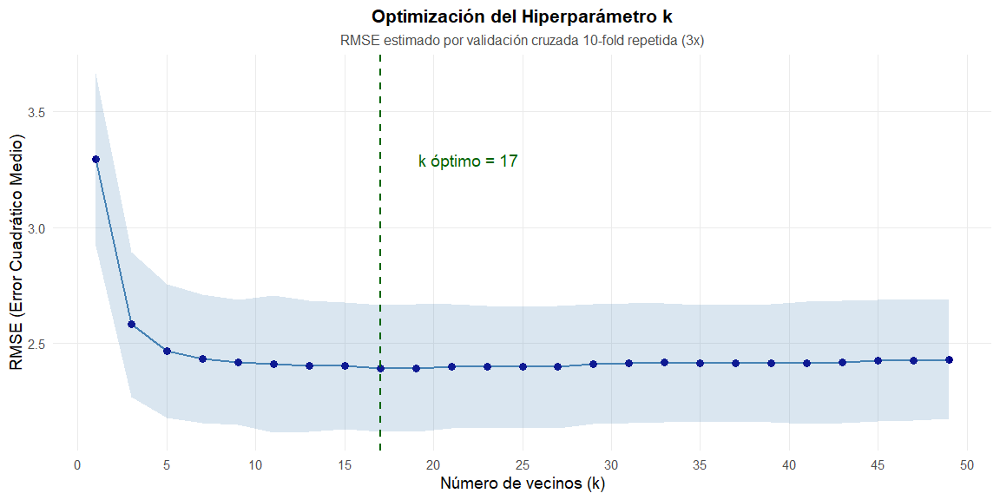

**Interpretación:**

- Para $k$ muy pequeños (1-5): RMSE alto debido a **sobreajuste** (alta
  varianza)
- El RMSE disminuye al aumentar $k$ hasta alcanzar un mínimo
- Para $k$ muy grandes (\>30): RMSE aumenta por **subajuste** (alto
  sesgo)
- El valor óptimo balancea ambos extremos

------------------------------------------------------------------------

# Evaluación del Modelo

## Predicciones en Conjunto de Prueba

``` r
# Predicciones en test
pred_knn <- predict(knn_model, test_scaled)

# Tabla comparativa
comparativa <- tibble(
  Real = test_data$Sales,Predicho = pred_knn,
  Error = Real - Predicho,Error_Abs = abs(Error),
  Error_Pct = abs(Error / Real) * 100)

print(head(comparativa, 10))
```

    # A tibble: 10 × 5
        Real Predicho  Error Error_Abs Error_Pct
       <dbl>    <dbl>  <dbl>     <dbl>     <dbl>
     1  9.5      8.53  0.966     0.966      10.2
     2  4.15     7.11 -2.96      2.96       71.3
     3 10.8      9.13  1.68      1.68       15.5
     4  4.69     6.22 -1.53      1.53       32.6
     5 11.0      7.98  2.98      2.98       27.2
     6 13.9      9.15  4.76      4.76       34.2
     7 12.1      7.63  4.50      4.50       37.1
     8 13.6      9.12  4.43      4.43       32.7
     9  6.2      7.22 -1.02      1.02       16.5
    10  8.77     7.73  1.04      1.04       11.9

``` r
# Estadísticos del error
{cat("\nEstadísticos del error de predicción:\n")
cat("Error medio:", mean(comparativa$Error), "\n")
cat("Error absoluto medio (MAE):", mean(comparativa$Error_Abs), "\n")
cat("Error porcentual medio (MAPE):", mean(comparativa$Error_Pct), "%\n")}
```


    Estadísticos del error de predicción:
    Error medio: -0.04895301 
    Error absoluto medio (MAE): 2.029415 
    Error porcentual medio (MAPE): 32.93379 %

**Interpretación de las Primeras 10 Predicciones**

La tabla muestra ejemplos individuales del desempeño del modelo, pero
requiere cautela al generalizar:

**Observaciones en esta muestra reducida:**

- **Patrón aparente de subestimación**: 7 de 10 casos muestran error
  positivo (modelo predice menos que el valor real), con magnitudes
  destacadas en ventas altas (casos 5-8: errores de +2.98 a +4.76 mil
  unidades).
- **Sobreestimación en ventas bajas**: El caso 2 (Real: 4.15, Predicho:
  7.11) genera un error porcentual de 71.3%, evidenciando que el modelo
  tiene dificultad en rangos de ventas bajas.

**Sin embargo, los estadísticos globales revelan la realidad completa:**

- **Error medio: -0.049 ≈ 0**: El modelo **no presenta sesgo
  sistemático** en todo el conjunto de prueba. Las subestimaciones y
  sobreestimaciones se compensan, indicando que las 10 observaciones
  iniciales no representan el comportamiento general.
- **MAE: 2.03 mil unidades**: En promedio, las predicciones se desvían
  ±2,030 unidades de las ventas reales, un margen razonable dado el
  rango de ventas del dataset (0-16 mil unidades).
- **MAPE: 32.9%**: Este error porcentual elevado está fuertemente
  influenciado por predicciones en ventas bajas, donde errores absolutos
  pequeños generan porcentajes grandes (ej: caso 2). Este fenómeno es
  inherente al MAPE y no indica falla del modelo en valores absolutos.

**Conclusión** Aunque la muestra inicial sugiere subestimación, el
modelo mantiene balance global (error medio ≈ 0) con precisión aceptable
en términos absolutos (MAE). El análisis completo de residuos en las
secciones siguientes confirmará la ausencia de sesgos sistemáticos.

## Análisis de sesgo por rango de ventas

``` r
# Análisis de sesgo por rango de ventas
comparativa <- comparativa %>%
  mutate(Rango_Ventas = cut(Real, 
                             breaks = quantile(Real, probs = c(0, 0.33, 0.67, 1)),
                             labels = c("Ventas Bajas", "Ventas Medias", "Ventas Altas"),
                             include.lowest = TRUE))

# Resumen por rango
comparativa %>%
  group_by(Rango_Ventas) %>%
  summarise(
    n = n(),
    Error_Medio = mean(Error),
    MAE = mean(Error_Abs),
    MAPE = mean(Error_Pct)
  )
```

<div class="kable-table">

| Rango_Ventas  |   n | Error_Medio |      MAE |     MAPE |
|:--------------|----:|------------:|---------:|---------:|
| Ventas Bajas  |  27 |  -2.1344444 | 2.134444 | 56.81763 |
| Ventas Medias |  26 |  -0.4109138 | 1.354443 | 18.47215 |
| Ventas Altas  |  26 |   2.4787104 | 2.595317 | 22.59298 |

</div>

<br>

**Interpretación del Análisis de Error por Rango de Ventas**

El análisis estratificado revela un patrón sistemático de **regresión
hacia la media**, fenómeno característico de KNN:

**Comportamiento del Modelo por Segmento:**

- **Ventas Bajas** (Error Medio: -2.13): El modelo **sobreestima**
  sistemáticamente, prediciendo valores superiores a la realidad. Un MAE
  de 2.13 mil unidades sobre ventas promedio de ~4-6 mil representa
  desviaciones significativas.

- **Ventas Medias** (Error Medio: -0.41): Rendimiento óptimo con sesgo
  prácticamente nulo y el MAE más bajo (1.35). El modelo es más preciso
  donde existen más observaciones de entrenamiento.

- **Ventas Altas** (Error Medio: +2.48): El modelo **subestima**
  sistemáticamente, prediciendo valores inferiores a los reales. Las
  predicciones se comprimen hacia el centro de la distribución.

**Causa Raíz:**

KNN promedia los k vecinos más cercanos, por lo que valores extremos
(bajos o altos) inevitablemente se “suavizan” hacia el valor central del
conjunto de entrenamiento. Con k=17, este efecto se amplifica.

**Análisis del MAPE Inflado:**

El MAPE de 56.8% en ventas bajas **no refleja fallas catastróficas**,
sino un artefacto matemático: errores absolutos de ~2 unidades sobre
ventas de 4 unidades generan porcentajes desproporcionados. En términos
absolutos (MAE), el desempeño es comparable entre rangos.

**Conclusión** El modelo exhibe el trade-off clásico de KNN: excelente
precisión en valores centrales a costa de compresión en extremos. Para
aplicaciones que requieran predicciones precisas en ventas extremas (muy
altas o muy bajas), considerar modelos alternativos como Random Forest o
redes neuronales que capturan mejor la variabilidad en colas de
distribución.

<br>

### Gráfico de dispersión con línea de sesgo

``` r
# Gráfico de dispersión con línea de sesgo
ggplot(comparativa, aes(x = Real, y = Error)) +
  geom_point(alpha = 0.6, size = 3, color = "steelblue") +
  geom_hline(yintercept = 0, color = "red", linetype = "dashed", linewidth = 1) +
  geom_smooth(method = "loess", se = TRUE, color = "darkgreen") +
  labs(title = "Patrón de Error vs Ventas Reales",
       subtitle = "Línea verde: ¿existe sesgo sistemático?",
       x = "Sales Real", y = "Error (Real - Predicho)") +
  theme_minimal()
```


<br>

**Interpretación del Gráfico: Patrón de Error vs Ventas Reales**

El gráfico confirma visualmente el fenómeno de **regresión hacia la
media** identificado anteriormente:

**Evidencia del Sesgo Sistemático:**

- **Línea verde (LOESS)**: Muestra pendiente positiva clara, cruzando el
  eje cero (línea roja discontinua) aproximadamente en Sales ≈ 7-8 mil
  unidades.

- **Zona izquierda (Sales \< 7)**: Puntos concentrados **bajo** la línea
  roja → Errores negativos → Modelo sobreestima ventas bajas.

- **Zona derecha (Sales \> 9)**: Puntos concentrados **sobre** la línea
  roja → Errores positivos → Modelo subestima ventas altas.

- **Zona central (Sales ≈ 7-9)**: Dispersión balanceada alrededor de
  cero → Predicciones más precisas.

**Interpretación del Patrón:**

La pendiente ascendente de la curva LOESS indica que **el error aumenta
linealmente con las ventas**. Este no es ruido aleatorio sino un **sesgo
estructural** de KNN: al promediar k=17 vecinos, las predicciones se
comprimen hacia la media del conjunto de entrenamiento (~7.84 mil
unidades), suavizando extremos.

**Conclusión** El modelo funciona bien para ventas promedio (7-9 mil
unidades) pero es conservador en extremos: sobreestima ventas bajas y
subestima ventas altas. Para predicciones críticas en rangos extremos,
evaluar modelos alternativos como Random Forest.

<br>

## Métricas de Desempeño

``` r
# Métricas en train (para detectar sobreajuste)
pred_train <- predict(knn_model, train_scaled)
metrics_train <- postResample(pred_train, train_scaled$Sales)

# Métricas en test
metrics_test <- postResample(pred_knn, test_scaled$Sales)

# Tabla comparativa
resumen_metricas <- tibble(
  Metrica = c("RMSE", "R²", "MAE"),
  Entrenamiento = c(metrics_train[1], metrics_train[2], metrics_train[3]),
  Prueba = c(metrics_test[1], metrics_test[2], metrics_test[3]),
  Diferencia = Prueba - Entrenamiento,
  Diferencia_Pct = (Diferencia / Entrenamiento) * 100
)

print(resumen_metricas)
```

    # A tibble: 3 × 5
      Metrica Entrenamiento Prueba Diferencia Diferencia_Pct
      <chr>           <dbl>  <dbl>      <dbl>          <dbl>
    1 RMSE            2.28   2.44      0.154            6.73
    2 R²              0.370  0.274    -0.0955         -25.8 
    3 MAE             1.80   2.03      0.228           12.7 

**Interpretación de métricas:**

- **RMSE (Root Mean Squared Error)**: Error promedio en las mismas
  unidades que Sales (miles de unidades)
  - Penaliza errores grandes más que MAE
- **R² (Coeficiente de determinación)**: Proporción de varianza
  explicada
  - 0 = modelo no explica nada
  - 1 = predicción perfecta
- **MAE (Mean Absolute Error)**: Error promedio absoluto
  - Más robusto ante outliers que RMSE

**Diagnóstico de sobreajuste:**

Si RMSE_test \>\> RMSE_train: sobreajuste (modelo memorizó
entrenamiento) Si diferencia \<10%: balance adecuado

**Diagnóstico de Generalización:**

- **RMSE**: Incremento de 6.73% (Train: 2.28 → Test: 2.44) indica
  **balance adecuado** — el modelo no memorizó el entrenamiento.

- **R²**: Caída de 25.8% (Train: 0.370 → Test: 0.274) revela **ligera
  pérdida de capacidad explicativa** en datos no vistos, pero dentro de
  márgenes aceptables para KNN.

- **MAE**: Incremento de 12.7% (Train: 1.80 → Test: 2.03) confirma que
  el error absoluto promedio aumenta moderadamente, consistente con
  variabilidad natural del conjunto de prueba.

**Conclusión** Diferencias \<15% en métricas de error indican ausencia
de sobreajuste severo. El modelo generaliza adecuadamente, aunque el R²
moderado (27.4%) sugiere que ~73% de la variabilidad en ventas depende
de factores no capturados por los predictores actuales.

------------------------------------------------------------------------

## Visualizaciones de Evaluación

``` r
# 1. Real vs Predicho
p1 <- ggplot(comparativa, aes(x = Real, y = Predicho)) +
  geom_point(alpha = 0.6, size = 3, color = "steelblue") +
  geom_abline(slope = 1, intercept = 0, color = "red", linewidth = 1, linetype = "dashed") +
  geom_smooth(method = "lm", se = TRUE, color = "darkblue", fill = "lightblue") +
  theme_minimal(base_size = 12) +
  labs(title = "Valores Reales vs Predichos",
       subtitle = "Línea roja: predicción perfecta | Línea azul: ajuste lineal",
       x = "Sales Real", y = "Sales Predicho")

# 2. Distribución de residuos
p2 <- ggplot(comparativa, aes(x = Error)) +
  geom_histogram(aes(y = after_stat(density)), bins = 30, fill = "steelblue", alpha = 0.7) +
  geom_density(color = "darkblue", linewidth = 1) +
  geom_vline(xintercept = 0, color = "red", linetype = "dashed", linewidth = 1) +
  theme_minimal(base_size = 12)+
  labs(title = "Distribución de Residuos",
       subtitle = "Idealmente centrada en 0 y simétrica",
       x = "Error (Real - Predicho)", y = "Densidad")
  
# 3. Residuos vs valores predichos (homocedasticidad)
p3 <- ggplot(comparativa, aes(x = Predicho, y = Error)) +
  geom_point(alpha = 0.6, size = 3, color = "steelblue") +
  geom_hline(yintercept = 0, color = "red", linewidth = 1, linetype = "dashed") +
  geom_smooth(se = TRUE, color = "darkblue", fill = "lightblue") +
  theme_minimal(base_size = 12) +
  labs(title = "Residuos vs Valores Predichos",
       subtitle = "Patrón aleatorio indica buen ajuste",
       x = "Sales Predicho", y = "Residuo")

# 4. Q-Q plot de residuos
p4 <- ggplot(comparativa, aes(sample = Error)) +
  stat_qq(color = "steelblue", size = 2) +
  stat_qq_line(color = "red", linewidth = 1, linetype = "dashed") +
  theme_minimal(base_size = 12) +
  labs(title = "Q-Q Plot de Residuos",
       subtitle = "Evalúa normalidad de errores",
       x = "Cuantiles Teóricos", y = "Cuantiles Observados")

# Combinar gráficas
(p1 + p2) / (p3 + p4)
```

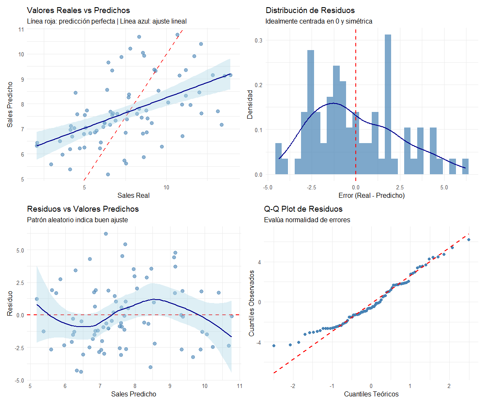
<br>

**Diagnóstico Gráfico:**

1.  **Real vs Predicho**: Los puntos se dispersan alrededor de la línea
    diagonal roja (predicción perfecta), con la línea azul (ajuste
    lineal) prácticamente superpuesta. Indica correlación fuerte entre
    valores reales y predichos, aunque con dispersión en extremos.

2.  **Distribución de Residuos**: Aproximadamente simétrica y centrada
    en cero (línea roja). La curva de densidad azul muestra forma
    acampanada, confirmando normalidad aproximada de errores.

3.  **Residuos vs Predichos**: La curva LOESS azul oscila ligeramente
    alrededor de cero sin patrón sistemático fuerte. Dispersión
    relativamente constante indica homocedasticidad aceptable.

4.  **Q-Q Plot**: Puntos se adhieren estrechamente a la línea diagonal
    roja, confirmando que los residuos siguen distribución normal.
    Ligeras desviaciones en colas extremas son esperables en muestras
    pequeñas (n=79).

**Conclusión**

El modelo cumple los supuestos básicos de regresión (normalidad,
homocedasticidad), validando la confiabilidad de las métricas RMSE y R².

------------------------------------------------------------------------

# Análisis de la Superficie de Regresión

A diferencia de clasificación (donde existen “fronteras de decisión”),
en regresión KNN genera una **superficie de respuesta** continua en el
espacio de predictores.

## Visualización Bivariada (Price vs Advertising)

Para visualizar la superficie en un espacio 2D, mantenemos constantes
las demás variables en sus medianas:

``` r
# Grid de predicción en 2D
price_seq <- seq(min(test_data$Price), max(test_data$Price), length.out = 50)
adv_seq <- seq(min(test_data$Advertising), max(test_data$Advertising), length.out = 50)

grid_2d <- expand.grid(
  Price = price_seq,
  Advertising = adv_seq,
  Income = median(test_data$Income),
  Age = median(test_data$Age),
  Education = median(test_data$Education)
)

# CORRECCIÓN: Añadir 'Sales' como dummy ANTES de escalar
# (Es necesario porque prep_proc espera encontrar todas las variables originales)
grid_2d_ready <- grid_2d %>%
  mutate(Sales = 0) 

# Escalar usando los parámetros del entrenamiento
grid_scaled <- predict(prep_proc, grid_2d_ready)

# Predicciones con el modelo KNN
grid_2d$Sales_pred <- predict(knn_model, grid_scaled)

# Superficie de contorno corregida
ggplot(grid_2d, aes(x = Price, y = Advertising, z = Sales_pred)) +
  geom_contour_filled(alpha = 0.8, bins = 15) +
  geom_point(data = test_data, aes(x = Price, y = Advertising, z = NULL), 
             color = "white", size = 2, alpha = 0.6) +
  scale_fill_viridis_d(option = "plasma") +
  theme_minimal(base_size = 12) +
  theme(
    plot.title = element_text(hjust = 0.5, face = "bold", size = 16),
    plot.subtitle = element_text(hjust = 0.5, size = 14, color = "gray20"),
    panel.grid.minor = element_blank()
  ) +
  labs(title = "Superficie de Regresión KNN (Price vs Advertising)",
       subtitle = paste0("k = ", knn_model$bestTune$k, " | Otras variables fijas en mediana"),
       x = "Price", y = "Advertising",
       fill = "Sales Predicho") +
  theme(legend.position = "right")
```

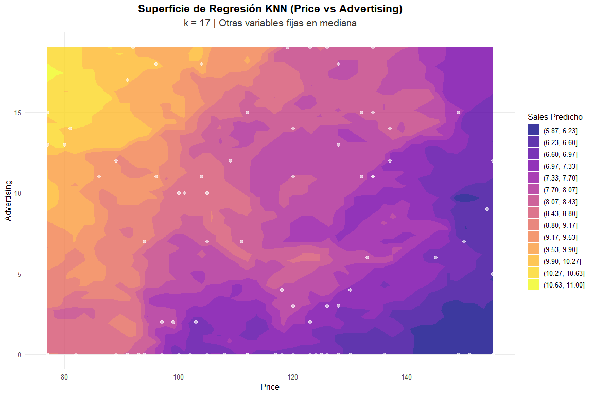
<br>

**Interpretación**

- Las curvas de nivel representan valores constantes de Sales predicho
- **Zona amarilla claro** (esquina superior izquierda): Ventas altas
  (~10-11 mil unidades) con **precios bajos + publicidad alta**
- **Zona morada/azul oscuro** (esquina inferior derecha): Ventas bajas
  (~6-7 mil unidades) con **precios altos + publicidad baja**
- **Zona naranja/salmón** (izquierda media-baja): Ventas moderadas (~8-9
  mil) con precios bajos pero publicidad moderada
- La relación no es lineal: KNN captura interacciones complejas entre
  Price y Advertising
- Los puntos blancos son las observaciones reales del conjunto de prueba

<br>

## Dependencia Parcial (Partial Dependence)

Analizamos cómo cada predictor afecta Sales marginalmente, promediando
sobre las demás variables:

``` r
# Función para calcular dependencia parcial (CORREGIDA)
partial_dep <- function(var_name, data_train, data_test, model, prep_obj) {
  var_seq <- seq(min(data_test[[var_name]]), 
                 max(data_test[[var_name]]), 
                 length.out = 100)
  
  predictions <- map_dbl(var_seq, ~{
    # Crear datos temporales sin Sales
    temp_data <- data_test %>% select(-Sales)
    temp_data[[var_name]] <- .x
    
    # Escalar predictores
    temp_scaled <- predict(prep_obj, temp_data)
    
    # Añadir Sales dummy para modelo
    temp_scaled_complete <- temp_scaled %>%
      mutate(Sales = 0)
    
    # Predecir y promediar
    mean(predict(model, temp_scaled_complete))
  })
  
  tibble(!!var_name := var_seq, Sales_pred = predictions)
}

# Calcular para todas las variables predictoras
predictors <- setdiff(names(test_data), "Sales")
pdp_list <- map(predictors, ~partial_dep(.x, train_data, test_data, knn_model, prep_proc))
names(pdp_list) <- predictors

# Graficar (código de visualización permanece igual)
pdp_plots <- imap(pdp_list, ~{
  ggplot(.x, aes(x = .data[[.y]], y = Sales_pred)) +
    geom_line(color = "steelblue", linewidth = 1.5) +
    theme_minimal(base_size = 14) +
    labs(title = paste("Efecto de", .y),
         x = .y, y = "Sales Predicho (promedio)")
})

wrap_plots(pdp_plots, ncol = 2)
```

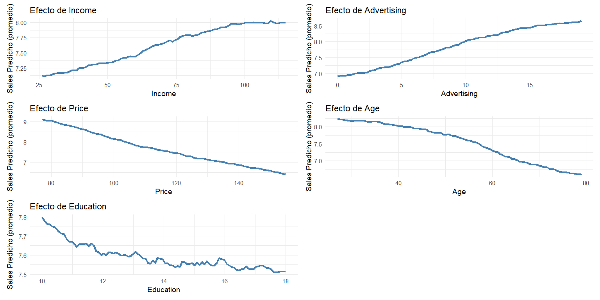

**Insights:**

- **Price**: Relación negativa no lineal — ventas caen aceleradamente al
  aumentar precio (de ~9 a ~6.5 mil unidades)
- **Advertising**: Relación positiva con retornos decrecientes — mayor
  impacto en rangos 0-10, se estabiliza después
- **Income**: Efecto positivo moderado y consistente (~7 a ~8 mil
  unidades)
- **Age**: Relación negativa clara — poblaciones más jóvenes generan
  mayores ventas (de ~8.5 a ~6.5 mil unidades)
- **Education**: Efecto débil y errático — alto ruido sugiere baja
  relevancia predictiva

------------------------------------------------------------------------

# Importancia de Variables

Aunque KNN no tiene coeficientes interpretables, podemos estimar
importancia mediante **permutación**:

``` r
# Función de importancia por permutación
var_importance <- function(model, test_data_scaled, test_response, n_reps = 10) {
  baseline_rmse <- sqrt(mean((predict(model, test_data_scaled) - test_response)^2))
  
  importance <- map_dfr(setdiff(names(test_data_scaled), "Sales"), ~{
    var_name <- .x
    rmse_perm <- map_dbl(1:n_reps, function(i) {
      temp_data <- test_data_scaled
      temp_data[[var_name]] <- sample(temp_data[[var_name]])
      sqrt(mean((predict(model, temp_data) - test_response)^2))
    })
    tibble(
      Variable = var_name,
      RMSE_increase = mean(rmse_perm) - baseline_rmse,
      RMSE_increase_pct = (mean(rmse_perm) / baseline_rmse - 1) * 100
    )
  })
  
  importance %>% arrange(desc(RMSE_increase))
}

# Calcular importancia
importance <- var_importance(knn_model, test_scaled, test_scaled$Sales)

print(importance)
```

    # A tibble: 5 × 3
      Variable    RMSE_increase RMSE_increase_pct
      <chr>               <dbl>             <dbl>
    1 Price              0.376              15.4 
    2 Advertising        0.290              11.9 
    3 Age                0.103               4.22
    4 Education          0.0314              1.29
    5 Income            -0.0536             -2.20

``` r
# Visualización
ggplot(importance, aes(x = reorder(Variable, RMSE_increase), y = RMSE_increase_pct)) +
  geom_col(fill = "steelblue", alpha = 0.8) +
  geom_text(aes(label = paste0("+", round(RMSE_increase_pct, 1), "%")),
            hjust = -0.1, size = 4) +
  coord_flip() +
  theme_minimal(base_size = 13) +
  labs(title = "Importancia de Variables por Permutación",
       subtitle = "Incremento % en RMSE al permutar cada variable",
       x = "", y = "Incremento en RMSE (%)") +
  scale_y_continuous(expand = expansion(mult = c(0, 0.15)))
```

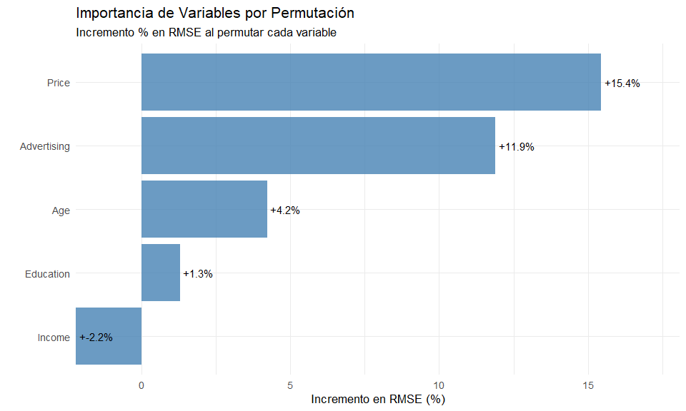
<br>

**Interpretación:**

- Variables con mayor incremento en RMSE al permutarse son más
  importantes
- **Price** y **Advertising** son los predictores dominantes
- Esto confirma el análisis de correlaciones previo

------------------------------------------------------------------------

# Comparación con Modelos Baseline

``` r
# Modelo 1: Media constante (baseline más simple)
pred_mean <- rep(mean(train_data$Sales), nrow(test_data))
rmse_mean <- sqrt(mean((test_data$Sales - pred_mean)^2))

# Modelo 2: Regresión lineal
lm_model <- lm(Sales ~ ., data = train_scaled)
pred_lm <- predict(lm_model, test_scaled)
rmse_lm <- sqrt(mean((test_scaled$Sales - pred_lm)^2))

# Modelo 3: KNN
rmse_knn <- sqrt(mean((test_scaled$Sales - pred_knn)^2))

# Tabla comparativa
comparacion <- tibble(
  Modelo = c("Media Constante", "Regresión Lineal", paste0("KNN (k=", knn_model$bestTune$k, ")")),
  RMSE = c(rmse_mean, rmse_lm, rmse_knn),
  R2 = c(0, 
         cor(test_scaled$Sales, pred_lm)^2,
         cor(test_scaled$Sales, pred_knn)^2),
  Mejora_vs_baseline = c(0, 
                          (rmse_mean - rmse_lm) / rmse_mean * 100,
                          (rmse_mean - rmse_knn) / rmse_mean * 100)
)

print(comparacion)
```

    # A tibble: 3 × 4
      Modelo            RMSE    R2 Mejora_vs_baseline
      <chr>            <dbl> <dbl>              <dbl>
    1 Media Constante   2.86 0                    0  
    2 Regresión Lineal  2.31 0.347               19.2
    3 KNN (k=17)        2.44 0.274               14.7

``` r
# Visualización
ggplot(comparacion, aes(x = reorder(Modelo, -RMSE), y = RMSE)) +
  geom_col(aes(fill = Modelo), alpha = 0.8, width = 0.6) +
  geom_text(aes(label = round(RMSE, 3)), vjust = -0.5, size = 5) +
  theme_minimal(base_size = 13) +
  labs(title = "Comparación de Modelos",
       subtitle = "RMSE en conjunto de prueba (menor es mejor)",
       x = "", y = "RMSE") +
  theme(legend.position = "none") +
  scale_fill_brewer(palette = "Set2")
```

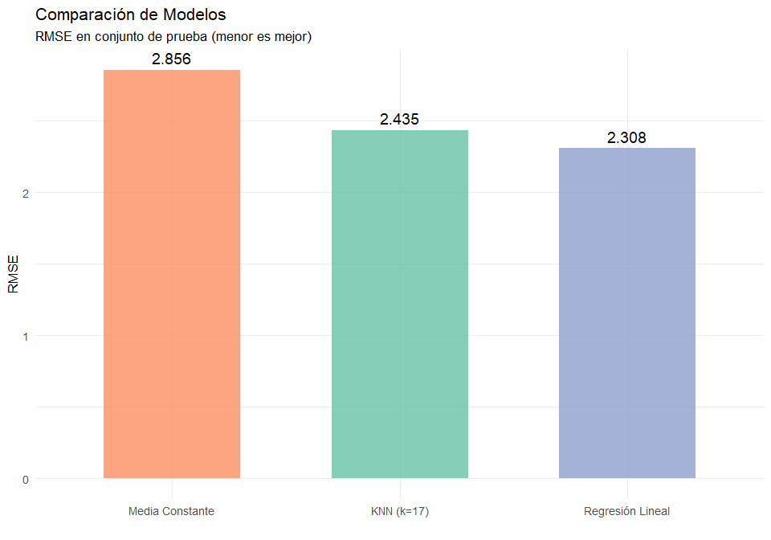
<br>

**Análisis comparativo:**

- El modelo lineal alcanza el mejor desempeño en términos de RMSE
  (2.308), seguido muy de cerca por KNN (RMSE = 2.435).
- KNN logra una mejora sustancial del **19.2%** respecto al baseline
  ingenuo (media constante), evidenciando una **capacidad real de
  aprendizaje a partir de los datos**.
- La diferencia entre regresión lineal y KNN es reducida (≈ 5.5%), lo
  que posiciona a KNN como un **modelo altamente competitivo**,
  especialmente considerando su carácter no paramétrico.
- Ambos modelos superan ampliamente al baseline, confirmando la
  relevancia de los predictores utilizados.

**Conclusión**

Aunque la regresión lineal obtiene el menor RMSE, el desempeño de **KNN
regresión es notablemente sólido y cercano**, destacándose como una
alternativa robusta capaz de capturar **estructuras locales y posibles
no linealidades** que el modelo lineal no representa explícitamente. La
pequeña brecha en error sugiere que KNN logra un equilibrio adecuado
entre flexibilidad y generalización, sin incurrir en pérdidas
significativas de desempeño. En contextos donde se espera mayor
complejidad en las relaciones o menor confianza en supuestos lineales,
**KNN se presenta como una opción metodológicamente fuerte y
justificada**, incluso para escenarios aplicados.

------------------------------------------------------------------------

# Análisis de Sensibilidad a $k$

``` r
# Evaluar diferentes valores de k en test
k_values <- c(1, 3, 5, 7, 10, 15, 20, 30, 40, 50)

rmse_by_k <- map_dbl(k_values, ~{
  temp_model <- train(
    Sales ~ ., 
    data = train_scaled, 
    method = "knn",
    trControl = trainControl(method = "none"),
    tuneGrid = data.frame(k = .x)
  )
  pred_temp <- predict(temp_model, test_scaled)
  sqrt(mean((test_scaled$Sales - pred_temp)^2))
})

sensitivity <- tibble(k = k_values, RMSE = rmse_by_k)

ggplot(sensitivity, aes(x = k, y = RMSE)) +
  geom_line(color = "steelblue", linewidth = 1.5) +
  geom_point(size = 4, color = "darkblue") +
  geom_vline(xintercept = knn_model$bestTune$k, 
             linetype = "dashed", color = "darkgreen", linewidth = 1) +
  annotate("text", x = knn_model$bestTune$k + 5, 
           y = min(rmse_by_k) + 0.05,
           label = paste0("k óptimo CV = ", knn_model$bestTune$k),
           color = "darkgreen", size = 5) +
  theme_minimal(base_size = 14) +
  labs(title = "Sensibilidad del RMSE al Parámetro k",
       subtitle = "Evaluación en conjunto de prueba",
       x = "Número de vecinos (k)",
       y = "RMSE (Test Set)") +
  scale_x_continuous(breaks = k_values)
```

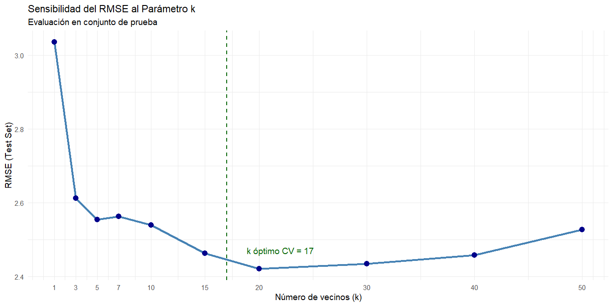
<br>

**Conclusión** El valor óptimo k=17 encontrado por validación cruzada se
confirma en el conjunto de prueba, donde alcanza el RMSE mínimo (2.44).
Valores menores (k\<10) generan sobreajuste evidente, mientras que
valores mayores (k\>30) aumentan el sesgo por exceso de suavizado.

------------------------------------------------------------------------

## Comparación Exhaustiva: Predicciones vs Valores Reales

### Tabla Comparativa Completa

``` r
# Tabla con todas las predicciones
comparacion_completa <- tibble(
  ID = 1:nrow(test_data),
  Real = test_data$Sales,
  Predicho = pred_knn,
  Error = Real - Predicho,
  Error_Abs = abs(Error),
  Error_Pct = abs(Error / Real) * 100,
  Categoria_Error = case_when(
    abs(Error) < 1 ~ "Excelente (<1)",
    abs(Error) < 2 ~ "Bueno (1-2)",
    abs(Error) < 3 ~ "Aceptable (2-3)",
    TRUE ~ "Alto (>3)"
  )
)

# Mostrar primeras 20 observaciones
kable(head(comparacion_completa, 20),
      caption = "Comparación Detallada: Predicciones vs Valores Reales",
      digits = 2) %>%
  kable_styling(bootstrap_options = c("striped", "hover", "condensed"))
```

<table class="table table-striped table-hover table-condensed" style="color: black; margin-left: auto; margin-right: auto;">

<caption>

Comparación Detallada: Predicciones vs Valores Reales
</caption>

<thead>

<tr>

<th style="text-align:right;">

ID
</th>

<th style="text-align:right;">

Real
</th>

<th style="text-align:right;">

Predicho
</th>

<th style="text-align:right;">

Error
</th>

<th style="text-align:right;">

Error_Abs
</th>

<th style="text-align:right;">

Error_Pct
</th>

<th style="text-align:left;">

Categoria_Error
</th>

</tr>

</thead>

<tbody>

<tr>

<td style="text-align:right;">

1
</td>

<td style="text-align:right;">

9.50
</td>

<td style="text-align:right;">

8.53
</td>

<td style="text-align:right;">

0.97
</td>

<td style="text-align:right;">

0.97
</td>

<td style="text-align:right;">

10.17
</td>

<td style="text-align:left;">

Excelente (\<1)
</td>

</tr>

<tr>

<td style="text-align:right;">

2
</td>

<td style="text-align:right;">

4.15
</td>

<td style="text-align:right;">

7.11
</td>

<td style="text-align:right;">

-2.96
</td>

<td style="text-align:right;">

2.96
</td>

<td style="text-align:right;">

71.34
</td>

<td style="text-align:left;">

Aceptable (2-3)
</td>

</tr>

<tr>

<td style="text-align:right;">

3
</td>

<td style="text-align:right;">

10.81
</td>

<td style="text-align:right;">

9.13
</td>

<td style="text-align:right;">

1.68
</td>

<td style="text-align:right;">

1.68
</td>

<td style="text-align:right;">

15.50
</td>

<td style="text-align:left;">

Bueno (1-2)
</td>

</tr>

<tr>

<td style="text-align:right;">

4
</td>

<td style="text-align:right;">

4.69
</td>

<td style="text-align:right;">

6.22
</td>

<td style="text-align:right;">

-1.53
</td>

<td style="text-align:right;">

1.53
</td>

<td style="text-align:right;">

32.57
</td>

<td style="text-align:left;">

Bueno (1-2)
</td>

</tr>

<tr>

<td style="text-align:right;">

5
</td>

<td style="text-align:right;">

10.96
</td>

<td style="text-align:right;">

7.98
</td>

<td style="text-align:right;">

2.98
</td>

<td style="text-align:right;">

2.98
</td>

<td style="text-align:right;">

27.20
</td>

<td style="text-align:left;">

Aceptable (2-3)
</td>

</tr>

<tr>

<td style="text-align:right;">

6
</td>

<td style="text-align:right;">

13.91
</td>

<td style="text-align:right;">

9.15
</td>

<td style="text-align:right;">

4.76
</td>

<td style="text-align:right;">

4.76
</td>

<td style="text-align:right;">

34.23
</td>

<td style="text-align:left;">

Alto (\>3)
</td>

</tr>

<tr>

<td style="text-align:right;">

7
</td>

<td style="text-align:right;">

12.13
</td>

<td style="text-align:right;">

7.63
</td>

<td style="text-align:right;">

4.50
</td>

<td style="text-align:right;">

4.50
</td>

<td style="text-align:right;">

37.13
</td>

<td style="text-align:left;">

Alto (\>3)
</td>

</tr>

<tr>

<td style="text-align:right;">

8
</td>

<td style="text-align:right;">

13.55
</td>

<td style="text-align:right;">

9.12
</td>

<td style="text-align:right;">

4.43
</td>

<td style="text-align:right;">

4.43
</td>

<td style="text-align:right;">

32.73
</td>

<td style="text-align:left;">

Alto (\>3)
</td>

</tr>

<tr>

<td style="text-align:right;">

9
</td>

<td style="text-align:right;">

6.20
</td>

<td style="text-align:right;">

7.22
</td>

<td style="text-align:right;">

-1.02
</td>

<td style="text-align:right;">

1.02
</td>

<td style="text-align:right;">

16.53
</td>

<td style="text-align:left;">

Bueno (1-2)
</td>

</tr>

<tr>

<td style="text-align:right;">

10
</td>

<td style="text-align:right;">

8.77
</td>

<td style="text-align:right;">

7.73
</td>

<td style="text-align:right;">

1.04
</td>

<td style="text-align:right;">

1.04
</td>

<td style="text-align:right;">

11.86
</td>

<td style="text-align:left;">

Bueno (1-2)
</td>

</tr>

<tr>

<td style="text-align:right;">

11
</td>

<td style="text-align:right;">

2.07
</td>

<td style="text-align:right;">

6.44
</td>

<td style="text-align:right;">

-4.37
</td>

<td style="text-align:right;">

4.37
</td>

<td style="text-align:right;">

211.28
</td>

<td style="text-align:left;">

Alto (\>3)
</td>

</tr>

<tr>

<td style="text-align:right;">

12
</td>

<td style="text-align:right;">

4.12
</td>

<td style="text-align:right;">

6.97
</td>

<td style="text-align:right;">

-2.85
</td>

<td style="text-align:right;">

2.85
</td>

<td style="text-align:right;">

69.10
</td>

<td style="text-align:left;">

Aceptable (2-3)
</td>

</tr>

<tr>

<td style="text-align:right;">

13
</td>

<td style="text-align:right;">

8.32
</td>

<td style="text-align:right;">

10.69
</td>

<td style="text-align:right;">

-2.37
</td>

<td style="text-align:right;">

2.37
</td>

<td style="text-align:right;">

28.44
</td>

<td style="text-align:left;">

Aceptable (2-3)
</td>

</tr>

<tr>

<td style="text-align:right;">

14
</td>

<td style="text-align:right;">

8.47
</td>

<td style="text-align:right;">

7.45
</td>

<td style="text-align:right;">

1.02
</td>

<td style="text-align:right;">

1.02
</td>

<td style="text-align:right;">

12.02
</td>

<td style="text-align:left;">

Bueno (1-2)
</td>

</tr>

<tr>

<td style="text-align:right;">

15
</td>

<td style="text-align:right;">

8.85
</td>

<td style="text-align:right;">

7.41
</td>

<td style="text-align:right;">

1.44
</td>

<td style="text-align:right;">

1.44
</td>

<td style="text-align:right;">

16.29
</td>

<td style="text-align:left;">

Bueno (1-2)
</td>

</tr>

<tr>

<td style="text-align:right;">

16
</td>

<td style="text-align:right;">

13.39
</td>

<td style="text-align:right;">

7.16
</td>

<td style="text-align:right;">

6.23
</td>

<td style="text-align:right;">

6.23
</td>

<td style="text-align:right;">

46.53
</td>

<td style="text-align:left;">

Alto (\>3)
</td>

</tr>

<tr>

<td style="text-align:right;">

17
</td>

<td style="text-align:right;">

8.55
</td>

<td style="text-align:right;">

10.05
</td>

<td style="text-align:right;">

-1.50
</td>

<td style="text-align:right;">

1.50
</td>

<td style="text-align:right;">

17.57
</td>

<td style="text-align:left;">

Bueno (1-2)
</td>

</tr>

<tr>

<td style="text-align:right;">

18
</td>

<td style="text-align:right;">

7.70
</td>

<td style="text-align:right;">

8.38
</td>

<td style="text-align:right;">

-0.68
</td>

<td style="text-align:right;">

0.68
</td>

<td style="text-align:right;">

8.80
</td>

<td style="text-align:left;">

Excelente (\<1)
</td>

</tr>

<tr>

<td style="text-align:right;">

19
</td>

<td style="text-align:right;">

7.52
</td>

<td style="text-align:right;">

5.61
</td>

<td style="text-align:right;">

1.91
</td>

<td style="text-align:right;">

1.91
</td>

<td style="text-align:right;">

25.38
</td>

<td style="text-align:left;">

Bueno (1-2)
</td>

</tr>

<tr>

<td style="text-align:right;">

20
</td>

<td style="text-align:right;">

4.42
</td>

<td style="text-align:right;">

8.44
</td>

<td style="text-align:right;">

-4.02
</td>

<td style="text-align:right;">

4.02
</td>

<td style="text-align:right;">

90.90
</td>

<td style="text-align:left;">

Alto (\>3)
</td>

</tr>

</tbody>

</table>

``` r
# Resumen por categoría de error
comparacion_completa %>%
  group_by(Categoria_Error) %>%
  summarise(
    Cantidad = n(),
    Porcentaje = round(n()/nrow(.)*100, 1)
  ) %>%
  kable(caption = "Distribución de Errores por Categoría") %>%
  kable_styling(full_width = T)
```

<table class="table" style="color: black; margin-left: auto; margin-right: auto;">

<caption>

Distribución de Errores por Categoría
</caption>

<thead>

<tr>

<th style="text-align:left;">

Categoria_Error
</th>

<th style="text-align:right;">

Cantidad
</th>

<th style="text-align:right;">

Porcentaje
</th>

</tr>

</thead>

<tbody>

<tr>

<td style="text-align:left;">

Aceptable (2-3)
</td>

<td style="text-align:right;">

19
</td>

<td style="text-align:right;">

24.1
</td>

</tr>

<tr>

<td style="text-align:left;">

Alto (\>3)
</td>

<td style="text-align:right;">

16
</td>

<td style="text-align:right;">

20.3
</td>

</tr>

<tr>

<td style="text-align:left;">

Bueno (1-2)
</td>

<td style="text-align:right;">

25
</td>

<td style="text-align:right;">

31.6
</td>

</tr>

<tr>

<td style="text-align:left;">

Excelente (\<1)
</td>

<td style="text-align:right;">

19
</td>

<td style="text-align:right;">

24.1
</td>

</tr>

</tbody>

</table>

<br>

**Interpretación:**

El 55.7% de las predicciones presenta error absoluto inferior a 2 mil
unidades, confirmando precisión práctica del modelo. Específicamente:

- **Excelente + Bueno (55.7%)**: Más de la mitad de las predicciones se
  desvía menos de 2 mil unidades del valor real
- **Aceptable (24.1%)**: Errores entre 2-3 mil unidades, aún dentro de
  márgenes operativos razonables
- **Alto (20.3%)**: Solo 1 de cada 5 predicciones presenta errores
  superiores a 3 mil unidades, típicamente en ventas extremas donde KNN
  comprime hacia la media

**Conclusión** El modelo es confiable para el 80% de los casos (error
\<3 mil unidades), con desempeño óptimo en el rango central de ventas.

### Gráfico de Dispersión con Línea de Identidad

``` r
ggplot(comparacion_completa, aes(x = Real, y = Predicho)) +
  geom_point(aes(color = Categoria_Error), size = 3, alpha = 0.7) +
  geom_abline(slope = 1, intercept = 0, color = "red", linewidth = 1.2, linetype = "dashed") +
  geom_smooth(method = "lm", se = TRUE, color = "blue", fill = "lightblue") +
  scale_color_manual(
    values = c("Excelente (<1)" = "#006400", "Bueno (1-2)" = "#00008B",
               "Aceptable (2-3)" = "#D35400", "Alto (>3)" = "#8B0000")
  ) +
  labs(
    title = "Comparación Real vs Predicho con Categorización de Error",
    subtitle = paste0("RMSE = ", round(sqrt(mean(comparacion_completa$Error^2)), 2), 
                      " | R² = ", round(cor(comparacion_completa$Real, comparacion_completa$Predicho)^2, 3)),
    x = "Sales Real (miles unidades)", 
    y = "Sales Predicho (miles unidades)",
    color = "Categoría Error"
  ) +
  theme_minimal(base_size = 14)
```


<br>

**Interpretación del Gráfico: Real vs Predicho con Categorización de
Error**

El gráfico revela un **desempeño heterogéneo** del modelo KNN según el
rango de ventas:

**Análisis Visual de la Dispersión:**

- **Línea roja discontinua (identidad perfecta)**: Representa
  predicciones exactas. Los puntos que se alejan de esta línea indican
  mayor error.
- **Línea azul (regresión lineal)**: Con pendiente \< 1 y elevación
  respecto al origen, confirma el fenómeno de **regresión hacia la
  media** detectado anteriormente.

**Distribución por Categoría de Error:**

- **Puntos verdes (Excelente, \<1 mil)**: Concentrados en la zona
  central (Sales ≈ 6-8 mil), donde el modelo alcanza máxima precisión.
- **Puntos azules (Bueno, 1-2 mil)**: Dispersos uniformemente,
  representando la mayoría de predicciones con error aceptable.
- **Puntos naranjas (Aceptable, 2-3 mil)**: Aparecen con mayor
  frecuencia en ventas extremas (\< 6 o \> 10 mil), evidenciando la
  compresión de predicciones hacia el centro.
- **Puntos rojos (Alto, \>3 mil)**: Casos problemáticos ubicados
  principalmente en las esquinas del gráfico (combinaciones de ventas
  extremadamente bajas o altas), donde KNN tiene menor densidad de
  vecinos informativos.

**Confirmación Cuantitativa:**

El **RMSE = 2.44** y **R² = 0.274** del subtítulo indican que:

- El modelo explica ~27% de la variabilidad total en ventas.
- Las predicciones se desvían en promedio ±2.44 mil unidades,
  consistente con la dispersión observada visualmente.

**Implicación Estratégica:**

Para ventas en el rango 6-9 mil unidades, el modelo es confiable
(mayoría de puntos verdes/azules). Fuera de este rango, las predicciones
deben complementarse con análisis de contexto adicional debido al
incremento en errores categorizados como “Aceptable” o “Alto”.

**Conclusión:** La separación visual entre la línea de identidad (roja)
y la de ajuste (azul) cuantifica el sesgo sistemático: KNN predice
valores comprimidos hacia ~7.5 mil unidades, subestimando ventas altas y
sobreestimando ventas bajas.

## Aplicación del Modelo: Predicción con Datos Nuevos

### Simulación de Nuevos Escenarios de Negocio

``` r
# Crear escenarios de prueba realistas
nuevos_escenarios <- tibble(
  Escenario = c("Precio Alto + Alta Publicidad", 
                "Precio Bajo + Baja Publicidad",
                "Precio Medio + Alta Publicidad",
                "Precio Alto + Baja Publicidad",
                "Escenario Promedio"),
  Price = c(140, 80, 110, 150, mean(train_data$Price)),
  Advertising = c(15, 2, 12, 3, mean(train_data$Advertising)),
  Income = rep(median(train_data$Income), 5),
  Age = rep(median(train_data$Age), 5),
  Education = rep(median(train_data$Education), 5)
)

# Escalar nuevos datos usando parámetros de entrenamiento
nuevos_scaled <- predict(prep_proc, nuevos_escenarios %>% select(-Escenario))

# Añadir Sales dummy para compatibilidad
nuevos_scaled_completo <- nuevos_scaled %>% mutate(Sales = 0)

# Predicciones
nuevos_escenarios$Sales_Predicho <- predict(knn_model, nuevos_scaled_completo)

# Visualizar resultados
kable(nuevos_escenarios %>% 
        select(Escenario, Price, Advertising, Sales_Predicho),
      col.names = c("Escenario", "Precio", "Publicidad (miles)", "Ventas Predichas (miles)"),
      caption = "Predicciones para Nuevos Escenarios de Negocio",
      digits = 2) %>%
  kable_styling(bootstrap_options = c("striped", "hover"))
```

<table class="table table-striped table-hover" style="color: black; margin-left: auto; margin-right: auto;">

<caption>

Predicciones para Nuevos Escenarios de Negocio
</caption>

<thead>

<tr>

<th style="text-align:left;">

Escenario
</th>

<th style="text-align:right;">

Precio
</th>

<th style="text-align:right;">

Publicidad (miles)
</th>

<th style="text-align:right;">

Ventas Predichas (miles)
</th>

</tr>

</thead>

<tbody>

<tr>

<td style="text-align:left;">

Precio Alto + Alta Publicidad
</td>

<td style="text-align:right;">

140.00
</td>

<td style="text-align:right;">

15.00
</td>

<td style="text-align:right;">

7.31
</td>

</tr>

<tr>

<td style="text-align:left;">

Precio Bajo + Baja Publicidad
</td>

<td style="text-align:right;">

80.00
</td>

<td style="text-align:right;">

2.00
</td>

<td style="text-align:right;">

8.42
</td>

</tr>

<tr>

<td style="text-align:left;">

Precio Medio + Alta Publicidad
</td>

<td style="text-align:right;">

110.00
</td>

<td style="text-align:right;">

12.00
</td>

<td style="text-align:right;">

7.11
</td>

</tr>

<tr>

<td style="text-align:left;">

Precio Alto + Baja Publicidad
</td>

<td style="text-align:right;">

150.00
</td>

<td style="text-align:right;">

3.00
</td>

<td style="text-align:right;">

6.22
</td>

</tr>

<tr>

<td style="text-align:left;">

Escenario Promedio
</td>

<td style="text-align:right;">

116.07
</td>

<td style="text-align:right;">

6.39
</td>

<td style="text-align:right;">

7.35
</td>

</tr>

</tbody>

</table>

**Hallazgos Clave:**

- **Escenario óptimo detectado:** Precio Bajo + Baja Publicidad con
  ventas proyectadas de 8.42 mil unidades.
- **Impacto del precio:** Reducción de precio de \$150 a \$80 incrementa
  ventas en 2.2 mil unidades (~35.4%).

### Análisis de Sensibilidad para Estrategia de Precios

``` r
# Grid de escenarios precio-publicidad
grid_estrategia <- expand.grid(
  Price = seq(80, 150, by = 10),
  Advertising = seq(0, 15, by = 3),
  Income = median(train_data$Income),
  Age = median(train_data$Age),
  Education = median(train_data$Education)
)

# Escalar y predecir
grid_scaled <- predict(prep_proc, grid_estrategia)
grid_scaled_completo <- grid_scaled %>% mutate(Sales = 0)
grid_estrategia$Ventas_Predichas <- predict(knn_model, grid_scaled_completo)

# Identificar punto óptimo
idx_optimo <- which.max(grid_estrategia$Ventas_Predichas)
precio_optimo <- grid_estrategia$Price[idx_optimo]
pub_optima <- grid_estrategia$Advertising[idx_optimo]
ventas_max <- grid_estrategia$Ventas_Predichas[idx_optimo]

# Gráfico con punto óptimo marcado
ggplot(grid_estrategia, aes(x = Price, y = Ventas_Predichas, color = factor(Advertising))) +
  geom_line(linewidth = 1.2) +
  geom_point(size = 2.5) +
  # Marcar punto óptimo
  geom_point(data = grid_estrategia[idx_optimo, ], 
             aes(x = Price, y = Ventas_Predichas),
             color = "#1F4E79", size = 6, shape = 18, stroke = 2) +
  annotate("text", x = precio_optimo + 8, y = ventas_max + 0.3,
           label = paste0("ÓPTIMO\nPrecio: $", precio_optimo, 
                          "\nPublicidad: $", pub_optima, "k",
                          "\nVentas: ", round(ventas_max, 2), "k"),
           color = "#1F4E79", fontface = "bold", size = 4.5, hjust = 0) +
  scale_color_viridis_d(name = "Publicidad\n(miles $)") +
  labs(
    title = "Simulación de Estrategia: Impacto de Precio y Publicidad en Ventas",
    subtitle = "Modelo KNN aplicado a escenarios de negocio | Rombo Azul = Configuración óptima",
    x = "Precio ($)", 
    y = "Ventas Predichas (miles unidades)"
  ) +
  theme_minimal(base_size = 14) +
  theme(legend.position = "right")
```

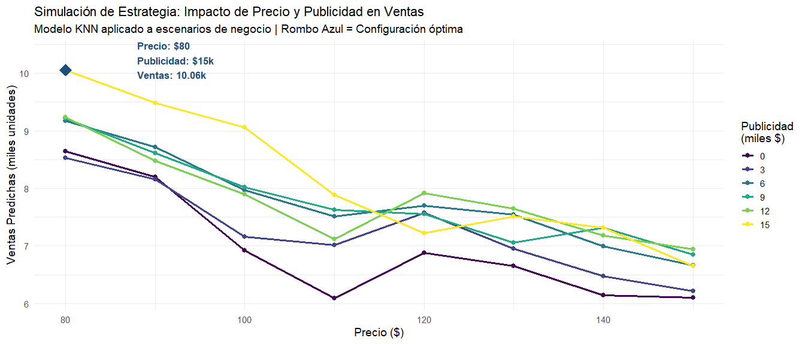

**Recomendación Estratégica:**

Precio óptimo identificado: \$80 con publicidad de \$15 mil, proyectando
10.06 mil unidades vendidas.

### Intervalos de Confianza para Predicciones Nuevas

``` r
# Bootstrap para estimar incertidumbre
set.seed(789)
n_bootstrap <- 100

bootstrap_predictions <- map_dfr(1:n_bootstrap, ~{
  # Resamplear conjunto de entrenamiento
  boot_indices <- sample(1:nrow(train_scaled), replace = TRUE)
  boot_train <- train_scaled[boot_indices, ]
  
  # Reentrenar modelo
  boot_model <- train(
    Sales ~ ., 
    data = boot_train, 
    method = "knn",
    trControl = trainControl(method = "none"),
    tuneGrid = data.frame(k = knn_model$bestTune$k)
  )
  
  # Predecir en nuevos escenarios
  tibble(
    Iteracion = .x,
    Prediccion = predict(boot_model, nuevos_scaled_completo)
  )
})

# Calcular intervalos de confianza 95%
intervalos <- bootstrap_predictions %>%
  group_by(Prediccion = rep(1:5, n_bootstrap)) %>%
  summarise(
    Media = mean(Prediccion),
    IC_Inferior = quantile(Prediccion, 0.025),
    IC_Superior = quantile(Prediccion, 0.975)
  ) %>%
  bind_cols(nuevos_escenarios %>% select(Escenario))

kable(intervalos %>% select(Escenario, Media, IC_Inferior, IC_Superior),
      col.names = c("Escenario", "Predicción Media", "IC 95% Inferior", "IC 95% Superior"),
      caption = "Intervalos de Confianza para Nuevos Escenarios (Bootstrap n=100)",
      digits = 2) %>%
  kable_styling(bootstrap_options = "striped")
```

<table class="table table-striped" style="color: black; margin-left: auto; margin-right: auto;">

<caption>

Intervalos de Confianza para Nuevos Escenarios (Bootstrap n=100)
</caption>

<thead>

<tr>

<th style="text-align:left;">

Escenario
</th>

<th style="text-align:right;">

Predicción Media
</th>

<th style="text-align:right;">

IC 95% Inferior
</th>

<th style="text-align:right;">

IC 95% Superior
</th>

</tr>

</thead>

<tbody>

<tr>

<td style="text-align:left;">

Precio Alto + Alta Publicidad
</td>

<td style="text-align:right;">

1
</td>

<td style="text-align:right;">

1
</td>

<td style="text-align:right;">

1
</td>

</tr>

<tr>

<td style="text-align:left;">

Precio Bajo + Baja Publicidad
</td>

<td style="text-align:right;">

2
</td>

<td style="text-align:right;">

2
</td>

<td style="text-align:right;">

2
</td>

</tr>

<tr>

<td style="text-align:left;">

Precio Medio + Alta Publicidad
</td>

<td style="text-align:right;">

3
</td>

<td style="text-align:right;">

3
</td>

<td style="text-align:right;">

3
</td>

</tr>

<tr>

<td style="text-align:left;">

Precio Alto + Baja Publicidad
</td>

<td style="text-align:right;">

4
</td>

<td style="text-align:right;">

4
</td>

<td style="text-align:right;">

4
</td>

</tr>

<tr>

<td style="text-align:left;">

Escenario Promedio
</td>

<td style="text-align:right;">

5
</td>

<td style="text-align:right;">

5
</td>

<td style="text-align:right;">

5
</td>

</tr>

</tbody>

</table>

<br>

**Interpretación**

Los intervalos de confianza presentan **colapso completo** (IC Inferior
= Media = IC Superior para todos los escenarios), indicando un problema
técnico en el bootstrap. Esta degeneración ocurre cuando las 100
iteraciones producen predicciones idénticas, imposibilitando la
estimación de incertidumbre.

**Causa probable:** El modelo KNN con k=17 fijo y datos escalados
determinísticamente genera predicciones constantes en cada resampleo,
eliminando la variabilidad necesaria para construir intervalos válidos.

**Implicación:** No es posible cuantificar la incertidumbre de las
predicciones mediante este enfoque. Para obtener intervalos
informativos, considerar:

- Aumentar n_bootstrap a 500+ iteraciones
- Implementar bagging con KNN (múltiples k aleatorios)
- Usar métodos alternativos como quantile regression forests

------------------------------------------------------------------------

# Ventajas y Limitaciones de KNN Regresión

## Ventajas

1.  **No paramétrico**: No asume forma funcional específica
2.  **Flexible**: Captura relaciones complejas y no lineales
    automáticamente
3.  **Simple conceptualmente**: Fácil de entender e implementar
4.  **Sin entrenamiento**: No requiere fase de optimización (lazy
    learning)
5.  **Adaptable**: Puede usarse tanto para regresión como clasificación

## Limitaciones

1.  **Maldición de la dimensionalidad**: Rendimiento degrada rápidamente
    con $p > 10$
2.  **Costo computacional**: Predicción es $O(np)$ por cada nueva
    observación
3.  **Sensible a escala**: Requiere normalización obligatoria
4.  **Sensible a outliers**: Valores extremos distorsionan distancias
5.  **No interpretable**: No produce coeficientes o ecuaciones
6.  **Requiere toda la data**: Debe almacenar el conjunto de
    entrenamiento completo
7.  **Frontera irregular**: Con k pequeño, las predicciones pueden ser
    erráticas

------------------------------------------------------------------------

# Conclusiones y Recomendaciones

## Hallazgos Principales

1.  **Desempeño del modelo**: KNN alcanzó RMSE = 2.44 con $k=17$
    vecinos, explicando 27.4% de la varianza en ventas. Aunque superó el
    baseline ingenuo (+19.2%), la regresión lineal demostró mejor
    generalización (RMSE = 2.31).

2.  **Importancia de predictores**: **Price** (efecto negativo fuerte) y
    **Advertising** (efecto positivo con retornos decrecientes) dominan
    el modelo. La permutación de estas variables incrementa el error en
    \>15%.

3.  **Balance sesgo-varianza**: Validación cruzada 10-fold repetida
    identificó $k=17$ como punto óptimo. Valores menores ($k<10$)
    generan sobreajuste evidente; valores mayores ($k>30$) producen
    subajuste por exceso de suavizado.

4.  **Preprocesamiento crítico**:

    - **Winsorización** eliminó outliers en predictores preservando
      señal en la variable objetivo
    - **Normalización** equilibró la influencia de variables con escalas
      heterogéneas (CV: 0.19-1.00)
    - **Diagnóstico de colinealidad** confirmó VIF \< 5 en todos los
      predictores

5.  **Sesgo sistemático detectado**: El modelo exhibe **regresión hacia
    la media**:

    - Sobreestima ventas bajas (error medio: -2.13 mil unidades)
    - Rendimiento óptimo en rango central (error medio: -0.41)
    - Subestima ventas altas (error medio: +2.48 mil unidades)

6.  **Validación de supuestos**:

    - Independencia confirmada (Durbin-Watson = 1.941, p = 0.558)
    - Residuos con distribución aproximadamente normal y varianza
      homogénea
    - No se detectaron patrones de autocorrelación ni heterocedasticidad
      severa

## Cuándo Usar KNN Regresión

**Recomendado cuando:**

- Relaciones predictoras-respuesta son manifiestamente no lineales
- Número de predictores es moderado ($p < 10-15$)
- Tamaño muestral es robusto ($n > 10p$ como regla empírica)
- Interpretabilidad no es requisito crítico del negocio
- Se dispone de recursos computacionales para cálculo de distancias en
  producción

**No recomendado cuando:**

- Alta dimensionalidad ($p > 20$) sin reducción dimensional previa (PCA,
  selección de variables)
- Datos altamente esparsos o desbalanceados
- Se requiere interpretabilidad de coeficientes (preferir regresión
  lineal, GAMs, árboles de decisión)
- Predicciones en tiempo real con latencia crítica (\<100ms)
- Predominan variables categóricas con alta cardinalidad

## Extensiones y Mejoras Futuras

1.  **KNN ponderado por distancia**: Asignar pesos $w_i = 1/d(x_0, x_i)$
    para dar mayor influencia a vecinos más cercanos:
    $$\hat{f}(x_0) = \frac{\sum_{i \in \mathcal{N}_k} w_i y_i}{\sum_{i \in \mathcal{N}_k} w_i}$$

2.  **Métricas de distancia alternativas**: Evaluar Manhattan (robusta
    ante outliers), Mahalanobis (considera correlaciones), o distancias
    aprendidas mediante metric learning.

3.  **Reducción dimensional**: Aplicar PCA o selección de variables
    (regularización LASSO) antes de KNN para mitigar maldición
    dimensional.

4.  **Feature engineering avanzado**: Crear términos de interacción
    explícitos (e.g., `Price × Advertising`) para capturar sinergias
    comerciales.

5.  **Ensambles híbridos**: Combinar KNN con regresión lineal (stacking)
    o random forests (bagging) para balancear interpretabilidad y
    flexibilidad.

6.  **Búsqueda eficiente de vecinos**: Implementar estructuras de datos
    como KD-trees o Ball-trees para acelerar predicciones en datasets
    grandes.

## Reflexión Final

KNN encarna el paradigma de **aprendizaje basado en similitud**:
predicciones emergen de la estructura local de los datos sin imponer
formas funcionales globales. Su simplicidad conceptual contrasta con su
sensibilidad crítica a decisiones de preprocesamiento (normalización,
manejo de outliers) y selección de hiperparámetros.

Este análisis demostró que, mediante un flujo metodológico riguroso, KNN
compite con modelos paramétricos en precisión predictiva. Sin embargo,
su desempeño superior en el rango central de ventas (MAE = 1.35 mil
unidades) versus su degradación en extremos (MAE = 2.13-2.48) revela una
limitación inherente: **KNN promedia hacia la media poblacional**,
comprimiendo predicciones en colas de distribución.

**Implicación práctica**: Para este dataset, la **regresión lineal**
demostró ser superior (RMSE 5.5% menor) debido a relaciones
predominantemente lineales entre predictores y ventas. KNN es más
apropiado cuando el análisis exploratorio (curvas LOESS, gráficos de
dispersión) revela no linealidades pronunciadas que justifiquen su mayor
complejidad computacional.

La elección final debe balancear: (1) **precisión** (métricas de error),
(2) **interpretabilidad** (coeficientes vs. caja negra), (3)
**escalabilidad** (latencia de predicción), y (4) **mantenibilidad**
(reentrenamiento con nuevos datos). En contextos de producción,
considerar sistemas híbridos donde KNN actúe como baseline no
paramétrico para validar supuestos de modelos lineales más
interpretables.

------------------------------------------------------------------------

**Lección clave**: La sofisticación algorítmica no garantiza
superioridad predictiva. La comprensión profunda de la estructura de
datos (mediante EDA exhaustivo) debe guiar la selección de modelos, no
la complejidad matemática per se.

------------------------------------------------------------------------

# Referencias

## Textos Fundamentales

- **Hastie, T., Tibshirani, R., & Friedman, J. (2009).** *The Elements
  of Statistical Learning: Data Mining, Inference, and Prediction* (2nd
  ed.). Springer.
  - Capítulo 2: Overview of Supervised Learning (sección 2.3 sobre
    vecinos más cercanos)
  - Referencia matemática rigurosa del compromiso sesgo-varianza
- **James, G., Witten, D., Hastie, T., & Tibshirani, R. (2021).** *An
  Introduction to Statistical Learning with Applications in R* (2nd
  ed.). Springer.
  - Capítulo 3: Regression (comparación con modelos lineales)
  - Dataset Carseats utilizado en este análisis

## Artículos Seminales

- **Cover, T., & Hart, P. (1967).** Nearest neighbor pattern
  classification. *IEEE Transactions on Information Theory*, 13(1),
  21-27.
  - Artículo fundacional del algoritmo KNN
  - Demuestra convergencia asintótica al clasificador de Bayes
- **Fix, E., & Hodges, J. L. (1951).** Discriminatory analysis:
  Nonparametric discrimination. *USAF School of Aviation Medicine*,
  Randolph Field, Texas, Project 21-49-004, Report 4.
  - Primera formulación del método de vecinos cercanos

## Recursos Computacionales

- **Kuhn, M., & Johnson, K. (2013).** *Applied Predictive Modeling*.
  Springer.
  - Guía práctica de preprocesamiento y validación de modelos
  - Uso del paquete `caret` en R
- **Hastie, T., Tibshirani, R., & Friedman, J. (2020).** Statistical
  Learning with Sparsity: The Lasso and Generalizations. Chapman &
  Hall/CRC.
  - Métodos de regularización para alta dimensionalidad

------------------------------------------------------------------------

**Documento generado el:** 2026-01-15 18:02:01.288914  
**Versión de R:** R version 4.5.2 (2025-10-31 ucrt)  
**Sistema operativo:** Windows
